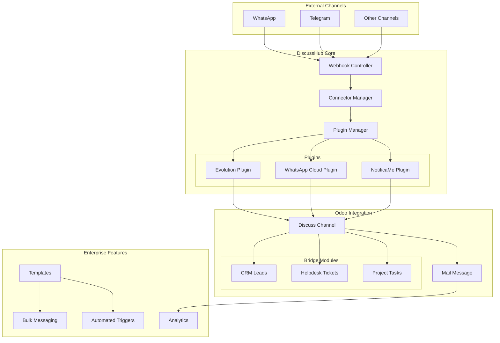

# 💬 DiscussHub - WhatsApp & Multi-Channel Integration for Odoo 18

> **Complete bidirectional messaging solution integrating WhatsApp, Telegram, and other channels directly into Odoo Discuss**

[](https://github.com/neoand/discuss_hub/actions/workflows/pre-commit.yml?query=branch%3Amain)
[](https://github.com/neoand/discuss_hub/actions/workflows/test.yml?query=branch%3Amain)
[](LICENSE)

---

## 🌍 Languages / Idiomas / Línguas

**📖 Read this in your language:**

- 🇺🇸 **[English](README.md)** (You are here / Estás aquí / Você está aqui)
- 🇧🇷 **[Português (Brasil)](community_addons/discuss_hub/docs/pt-br/README.md)** - Documentação completa em português
- 🇪🇸 **[Español (Latinoamérica)](community_addons/discuss_hub/docs/es/README.md)** - Documentación completa en español

---

## 📖 Table of Contents

- [Overview](#-overview)
- [Key Features](#-key-features)
- [Quick Start](#-quick-start)
- [Architecture](#-architecture)
- [Modules](#-modules)
- [Documentation](#-documentation)
- [Screenshots](#-screenshots)
- [Contributing](#-contributing)
- [License](#-license)

---

## 🎯 Overview

**DiscussHub** is a comprehensive Odoo 18 addon that seamlessly integrates external messaging channels (WhatsApp, Telegram, etc.) into Odoo's native Discuss application. It enables:

- **Bidirectional Communication**: Send and receive messages directly from Odoo
- **Multi-Module Integration**: Extend CRM, Helpdesk, Projects with messaging capabilities
- **Plugin Architecture**: Easily add new messaging providers
- **Enterprise Features**: Bulk messaging, analytics, automated triggers, templates

### 🎬 What Can You Do?

- 💬 Chat with customers via WhatsApp directly in Odoo Discuss
- 📊 Track all conversations linked to CRM Leads, Helpdesk Tickets, or Project Tasks
- 🤖 Automate messages based on record events (stage changes, creation, etc.)
- 📱 Send bulk WhatsApp campaigns using templates
- 📈 Monitor messaging metrics and analytics
- 🔌 Extend to support any messaging platform through plugins

---

## ✨ Key Features

### 🔌 Core Integration
- **Evolution API Plugin** (WhatsApp via Baileys) - 1,280 LOC
- **WhatsApp Cloud API Plugin** (Official Business API) - 497 LOC
- **NotificaMe Plugin** - 133 LOC
- **Extensible Plugin System** - Add your own providers

### 📦 Bridge Modules (App Integrations)
- **discusshub_crm**: Integrate WhatsApp with CRM Leads/Opportunities (~450 LOC)
- **discusshub_helpdesk**: Integrate WhatsApp with Helpdesk Tickets (~200 LOC)
- **discusshub_project**: Integrate WhatsApp with Project Tasks (~150 LOC)

### 🚀 Enterprise Features
- **Message Templates**: Jinja2-based templates with 10 categories
- **Bulk Messaging**: Send templates to multiple records with rate limiting
- **Analytics Dashboard**: SQL views with messaging metrics
- **Automated Triggers**: 5 trigger types (creation, update, stage change, etc.)
- **Attachment Support**: Send images, videos, documents, audio
- **Routing System**: Distribute conversations to team members (round-robin, random)

### 💡 Developer Tools
- **DiscussHub Mixin**: Abstract mixin to add messaging to ANY Odoo model
- **Comprehensive Tests**: 3,388 lines of test code, 69+ tests
- **Well-Documented**: 60+ pages in English & Portuguese
- **Docker Ready**: Production & development compose files included

---

## 🚀 Quick Start

### Prerequisites

- Docker & Docker Compose
- Git

### ⚡ 3-Minute Setup

```bash
# 1. Clone the repository
git clone https://github.com/neoand/discuss_hub.git
cd discuss_hub

# 2. Start services (Odoo + PostgreSQL + Evolution API + N8N + Redis)
docker compose -f compose-dev.yaml up -d

# 3. Wait for services to initialize (~30 seconds)
sleep 30

# 4. Load N8N workflows (optional automation)
docker compose -f compose-dev.yaml exec -u node -it n8n sh -c "n8n import:workflow --input=/n8n-workflows.yaml"
docker compose -f compose-dev.yaml exec -u node -it n8n sh -c "n8n update:workflow --all --active=true"
docker compose -f compose-dev.yaml restart n8n

# 5. Access Odoo
# URL: http://localhost:8069/?debug=1
# Email: admin
# Password: admin
```

### 📱 Connect WhatsApp

1. Navigate to **Discuss Hub → Connectors**
2. Open the default Evolution connector
3. Click **"Start Instance"**
4. Scan the QR Code with WhatsApp
5. Start receiving messages!

---

## 🏗️ Architecture



### Key Components

| Component | Description | Lines of Code |
|-----------|-------------|---------------|
| **discuss_hub** | Core module with connector & plugin system | ~2,936 |
| **discusshub_mixin** | Abstract mixin for any model integration | 266 |
| **automated_trigger** | Event-based message automation | 423 |
| **message_template** | Jinja2 template system | ~200 |
| **bulk_send_wizard** | Mass messaging with rate limiting | ~200 |
| **analytics** | SQL views for metrics | ~150 |

---

## 📦 Modules

### Core Module

#### `discuss_hub` (Base Module)
The foundation of the messaging integration system.

**Main Features:**
- Connector management (start/stop/configure instances)
- Plugin-based architecture
- Webhook processing
- Message routing to discuss.channel
- Support for all message types (text, media, location, contacts, reactions)

**Directory Structure:**
```
community_addons/discuss_hub/
├── models/
│   ├── models.py              # Main connector model
│   ├── discuss_channel.py     # Channel extensions
│   ├── mail_message.py        # Message extensions
│   ├── routing_manager.py     # Team routing
│   ├── bot_manager.py         # Bot handlers
│   ├── message_template.py    # Template system
│   ├── automated_trigger.py   # Automation triggers
│   ├── analytics.py           # Dashboard metrics
│   ├── discusshub_mixin.py    # Abstract mixin
│   └── plugins/
│       ├── base.py            # Plugin interface
│       ├── evolution.py       # Evolution API (1,280 LOC)
│       ├── whatsapp_cloud.py  # WhatsApp Cloud (497 LOC)
│       └── notificame.py      # NotificaMe (133 LOC)
├── controllers/
│   └── controllers.py         # Webhook endpoints
├── wizard/
│   ├── bulk_send_wizard.py    # Bulk messaging
│   └── send_template_wizard.py
├── views/                     # XML views
├── security/                  # ACL rules
├── tests/                     # 3,388 lines of tests
└── docs/                      # Documentation (EN & PT-BR)
```

---

### Bridge Modules (App Integrations)

These modules extend Odoo apps with WhatsApp messaging capabilities using the `discusshub.mixin`.

#### `discusshub_crm` - CRM Integration

Adds WhatsApp channels to CRM Leads and Opportunities.

**Features:**
- Link WhatsApp channels to leads/opportunities
- Send messages directly from lead form
- Track conversation history
- Auto-detect phone from partner or lead fields
- Custom channel naming based on lead stage

**Usage Example:**
```python
# Create lead with WhatsApp channel
lead = env['crm.lead'].create({
    'name': 'John Doe Opportunity',
    'partner_id': partner.id,
})

# Create WhatsApp channel
lead.action_create_discusshub_channel()

# Send message
lead.action_send_discusshub_message()
```

**Files:**
```
community_addons/discusshub_crm/
├── models/
│   └── crm_lead.py           # CRM Lead extensions (~450 LOC)
├── views/
│   └── crm_lead_views.xml    # Form view buttons
└── README.md
```

---

#### `discusshub_helpdesk` - Helpdesk Integration

Integrate support tickets with WhatsApp for customer communication.

**Features:**
- Link WhatsApp channels to helpdesk tickets
- Respond to customers via WhatsApp from ticket form
- Track ticket conversations
- Auto-detect customer phone

**Usage Example:**
```python
# Create ticket with WhatsApp
ticket = env['helpdesk.ticket'].create({
    'name': 'Customer Issue #123',
    'partner_id': partner.id,
})

# Link WhatsApp channel
ticket.action_create_discusshub_channel()
```

**Files:**
```
community_addons/discusshub_helpdesk/
├── models/
│   └── helpdesk_ticket.py    # Ticket extensions (~200 LOC)
├── views/
│   └── helpdesk_ticket_views.xml
└── README.md
```

---

#### `discusshub_project` - Project Integration

Connect project tasks with team communication via WhatsApp.

**Features:**
- Link WhatsApp channels to project tasks
- Communicate with clients about task progress
- Track task-related conversations
- Support for assignee/follower notifications

**Usage Example:**
```python
# Create task with WhatsApp
task = env['project.task'].create({
    'name': 'Website Redesign',
    'partner_id': partner.id,
})

# Create WhatsApp channel for task
task.action_create_discusshub_channel()
```

**Files:**
```
community_addons/discusshub_project/
├── models/
│   └── project_task.py       # Task extensions (~150 LOC)
├── views/
│   └── project_task_views.xml
└── README.md
```

---

### Using the DiscussHub Mixin

The `discusshub.mixin` is an **abstract model** that can be inherited by ANY Odoo model to add messaging capabilities.

#### Quick Integration Guide

```python
from odoo import models, fields

class MyCustomModel(models.Model):
    _name = 'my.custom.model'
    _inherit = ['my.custom.model', 'discusshub.mixin']

    # That's it! Your model now has:
    # - discusshub_channel_id field
    # - discusshub_message_count field
    # - discusshub_last_message_date field
    # - action_send_discusshub_message() method
    # - action_create_discusshub_channel() method
    # - action_open_discusshub_channel() method
```

#### Customization (Optional)

Override helper methods for custom behavior:

```python
def _get_discusshub_destination(self):
    """Custom phone number detection."""
    if self.custom_phone_field:
        return self.custom_phone_field
    return super()._get_discusshub_destination()

def _get_discusshub_channel_name(self):
    """Custom channel naming."""
    return f"WhatsApp: {self.name} - {self.stage_id.name}"
```

---

## 📚 Documentation

### 🌍 Documentation by Language

| Language | Main Guide | Bridge Modules | Specialized |
|----------|------------|----------------|-------------|
| 🇺🇸 **English** | [README](community_addons/discuss_hub/docs/en/README.md) | [Bridge Modules](community_addons/discuss_hub/docs/en/Bridge%20Modules.md) | [Evolution Plugin](community_addons/discuss_hub/docs/en/Evolution%20Plugin.md) |
| 🇧🇷 **Português** | [README](community_addons/discuss_hub/docs/pt-br/README.md) | [Módulos Bridge](community_addons/discuss_hub/docs/pt-br/Módulos%20Bridge.md) | [Troubleshooting](community_addons/discuss_hub/docs/pt-br/Troubleshooting.md) |
| 🇪🇸 **Español** | [README](community_addons/discuss_hub/docs/es/README.md) | Coming soon | Coming soon |

### 📖 Quick Access Guides

#### Getting Started
- 🚀 **[Quick Start](community_addons/discuss_hub/docs/SETUP.md)** - Installation and basic setup
- 🔥 **[Evolution Plugin Guide](community_addons/discuss_hub/docs/en/Evolution%20Plugin.md)** - WhatsApp Baileys integration
- 🔗 **[Bridge Modules Guide](community_addons/discuss_hub/docs/en/Bridge%20Modules.md)** - Integrate with CRM, Helpdesk, Project

#### Development
- 🛠️ **[Plugin Development](community_addons/discuss_hub/docs/en/Plugin%20Development.md)** - Create custom messaging plugins
- 🔌 **[Creating Your Own Bridge](community_addons/discuss_hub/docs/en/Bridge%20Modules.md#creating-your-own-bridge)** - Extend any Odoo module
- 🧪 **[Test Documentation](community_addons/discuss_hub/tests/README.md)** - Running and writing tests

#### Operations
- 🐳 **[Docker Setup](community_addons/discuss_hub/compose.yaml)** - Production deployment
- 🔧 **[Troubleshooting](community_addons/discuss_hub/docs/pt-br/Troubleshooting.md)** - Common issues & solutions (PT-BR)
- 📊 **[Architecture Diagrams](community_addons/discuss_hub/docs/assets/diagrams.md)** - System design

---

## 📸 Screenshots

### Connector Management


### WhatsApp in CRM Lead


### Message Templates


### Analytics Dashboard


---

## 🧪 Testing

The project includes comprehensive test coverage (3,388 lines of test code).

### Run Tests

```bash
# Run all tests
docker compose -f compose-dev.yaml exec odoo odoo -c /etc/odoo/odoo.conf \
  --test-enable --stop-after-init -u discuss_hub

# Run specific test
docker compose -f compose-dev.yaml exec odoo odoo -c /etc/odoo/odoo.conf \
  --test-enable --stop-after-init -u discuss_hub \
  --test-tags /discuss_hub:TestEvolutionPlugin.test_send_text_message
```

### Test Coverage

| Module | Test Files | Tests | Lines of Code |
|--------|------------|-------|---------------|
| discuss_hub | 8 | 69+ | 3,388 |
| Evolution Plugin | test_evolution.py | 69 | 1,575 |
| Base Plugin | test_base.py | 15+ | 754 |
| Controllers | test_controller.py | 10+ | 523 |

---

## 🗺️ Roadmap

### Phase 1 ✅ (Completed)
- [x] Core connector framework
- [x] Evolution API plugin (WhatsApp Baileys)
- [x] Bidirectional messaging
- [x] DiscussHub mixin for extensibility

### Phase 2 ✅ (Completed)
- [x] CRM integration (discusshub_crm)
- [x] Helpdesk integration (discusshub_helpdesk)
- [x] Project integration (discusshub_project)

### Phase 3 ✅ (Completed)
- [x] Message templates with Jinja2
- [x] Bulk messaging wizard
- [x] Analytics dashboard
- [x] Automated triggers

### Phase 4 🚧 (In Progress)
- [ ] WhatsApp Cloud API improvements
- [ ] Telegram plugin
- [ ] Multi-language template support
- [ ] Advanced routing algorithms

### Phase 5 📋 (Planned)
- [ ] AI-powered auto-responses
- [ ] Chatbot integration
- [ ] Sentiment analysis
- [ ] Voice message support

---

## 🤝 Contributing

We welcome contributions! Please follow these steps:

1. **Fork the repository**
2. **Create a feature branch**: `git checkout -b feature/amazing-feature`
3. **Commit your changes**: `git commit -m 'Add amazing feature'`
4. **Push to branch**: `git push origin feature/amazing-feature`
5. **Open a Pull Request**

### Development Guidelines

- Follow Odoo coding standards
- Add tests for new features
- Update documentation
- Run pre-commit hooks: `pre-commit install`

---

## 📄 License

This project is licensed under **AGPL-3.0**. See [LICENSE](LICENSE) file for details.

Each module may have its own license as specified in its `__manifest__.py` file.

---

## 🙏 Acknowledgments

- **Odoo Community Association (OCA)** - For community modules and standards
- **Evolution API** - For the excellent WhatsApp Baileys integration
- **Contributors** - Thank you to all contributors who have helped improve this project

---

## 📞 Support

- **Documentation**: [docs/](community_addons/discuss_hub/docs/)
- **Issues**: [GitHub Issues](https://github.com/neoand/discuss_hub/issues)
- **Discussions**: [GitHub Discussions](https://github.com/neoand/discuss_hub/discussions)

---

## 🌟 Star History

If you find this project useful, please consider giving it a ⭐ on GitHub!

---

**Made with ❤️ by the DiscussHub Team**

*Empowering businesses with seamless multi-channel communication in Odoo*
