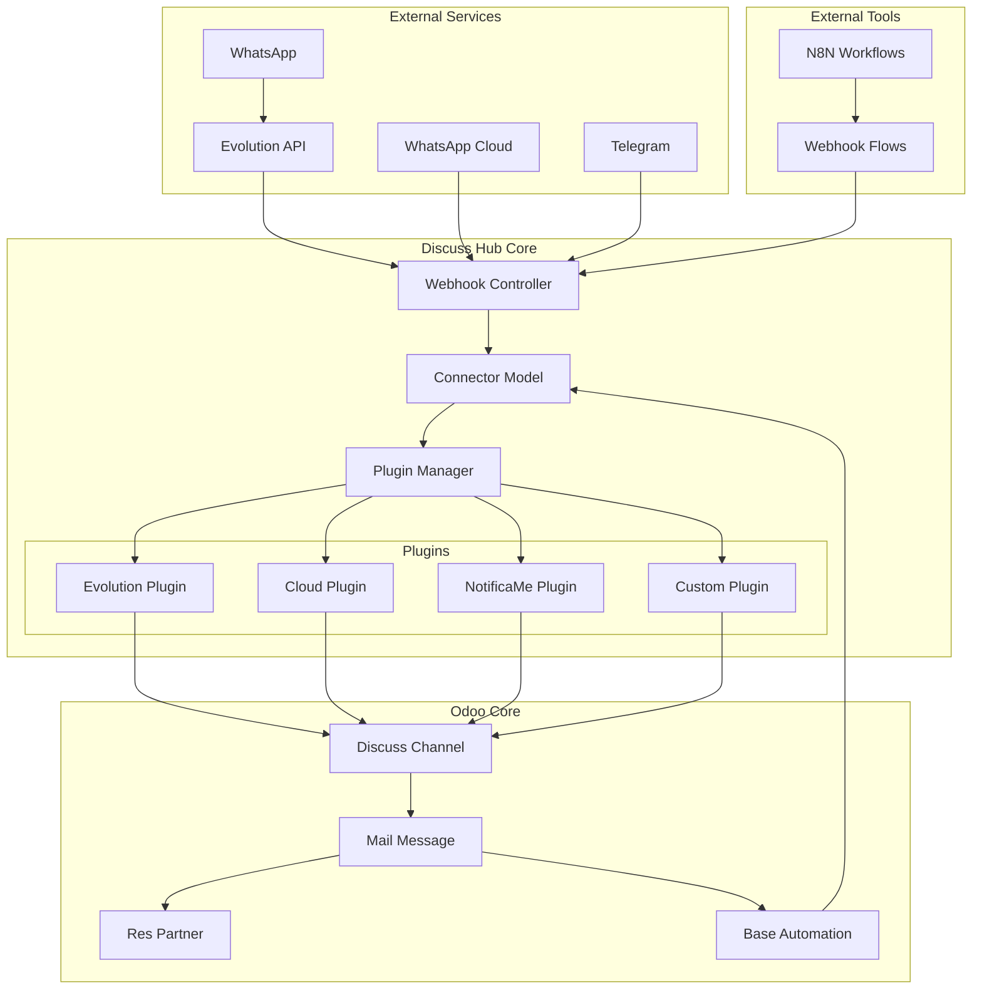
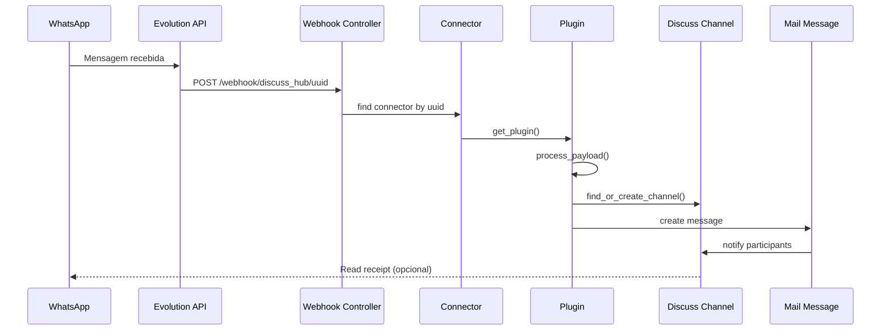
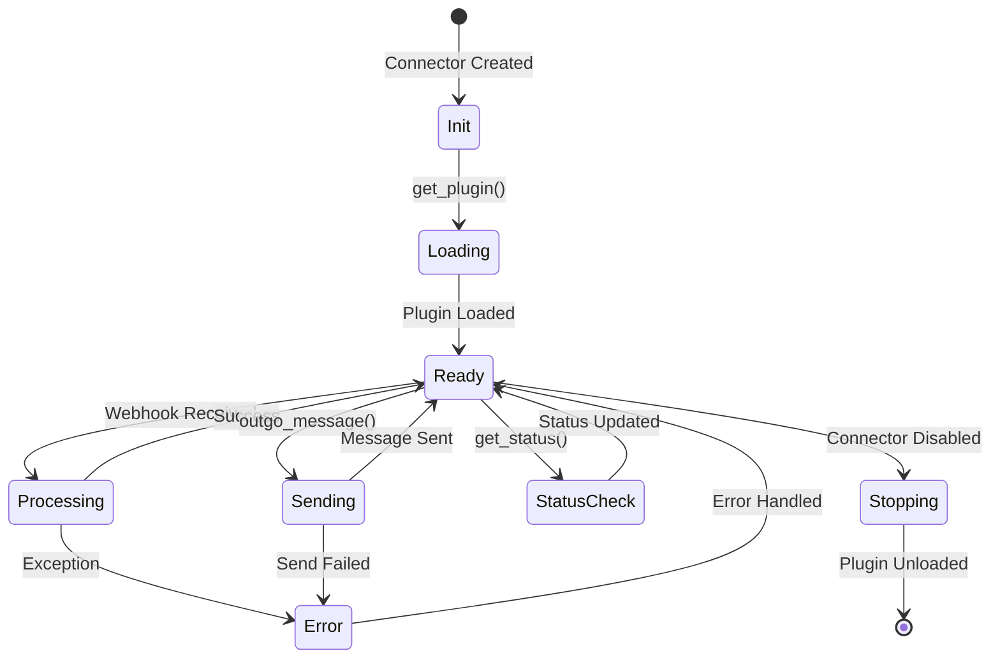
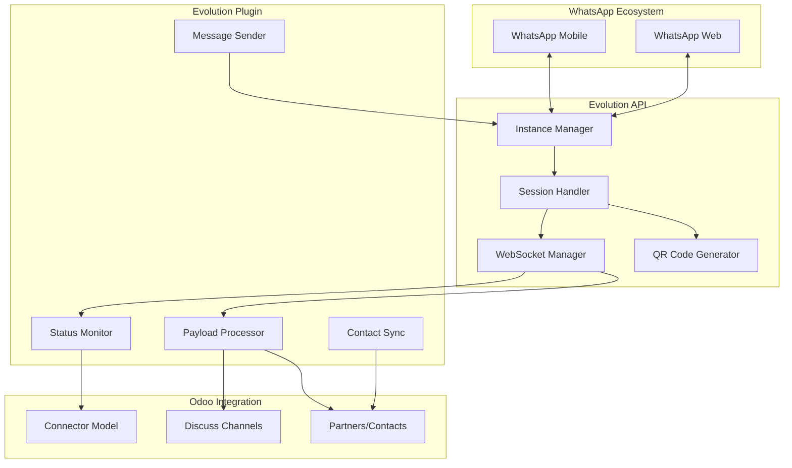
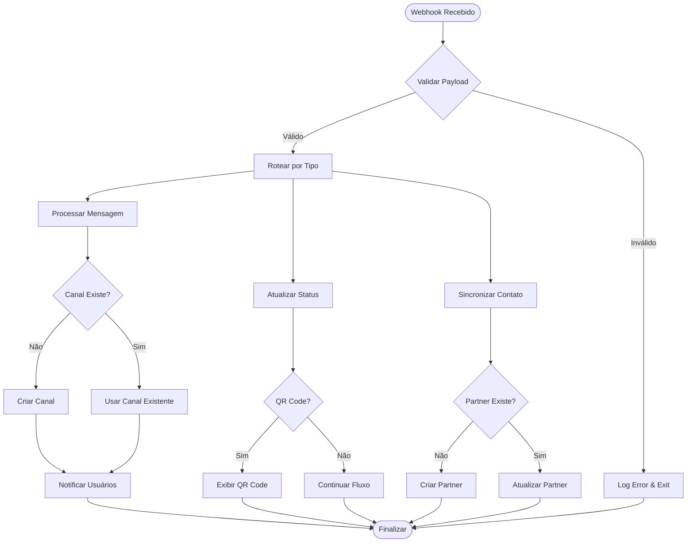
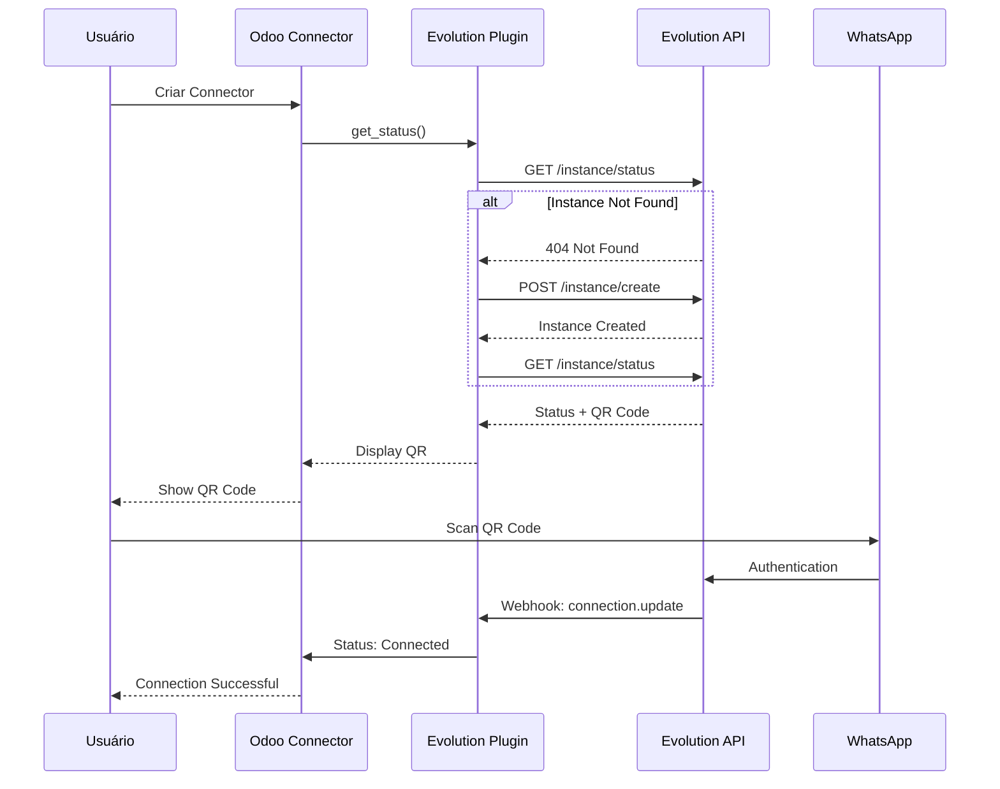
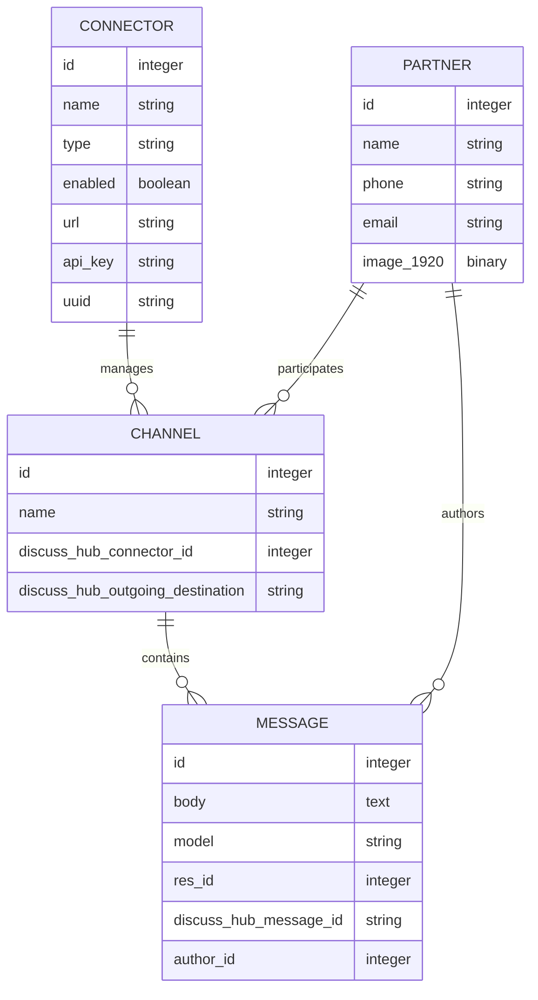

# Diagramas e Arquitetura 📊

Esta página contém diagramas explicativos da arquitetura e fluxos do Discuss Hub.

## 🏗️ Arquitetura Geral



## 🔄 Fluxo de Mensagens Recebidas



## 📤 Fluxo de Mensagens Enviadas

```mermaid
sequenceDiagram
    participant USER as Usuário Odoo
    participant CHANNEL as Discuss Channel
    participant AUTO as Base Automation
    participant CONN as Connector
    particle PLUGIN as Plugin
    participant API as Evolution API
    participant WA as WhatsApp

    USER->>CHANNEL: Digita mensagem
    CHANNEL->>AUTO: Trigger on message create
    AUTO->>CONN: outgo_message()
    CONN->>PLUGIN: outgo_message()
    PLUGIN->>API: POST /message/sendText
    API->>WA: Envia mensagem
    WA-->>API: Confirmação
    API-->>PLUGIN: Response
    PLUGIN-->>CONN: Result
```

## 🔌 Ciclo de Vida do Plugin



## 📱 Arquitetura do Plugin Evolution



## 🌐 Fluxo de Webhooks N8N



## 🔒 Fluxo de Autenticação



## 📊 Modelo de Dados



---

## 🎨 Configuração do Mermaid

Para visualização adequada no Obsidian, instale o plugin "Mermaid" e configure:

```json
{
  "theme": "default",
  "themeVariables": {
    "primaryColor": "#4f46e5",
    "primaryTextColor": "#1f2937",
    "primaryBorderColor": "#6b7280",
    "lineColor": "#9ca3af",
    "sectionBkColor": "#f9fafb",
    "altSectionBkColor": "#ffffff",
    "gridColor": "#e5e7eb"
  }
}
```

---

## 🔗 Links Relacionados

- [[README|Documentação Principal]]
- [[Plugin Development|Desenvolvimento de Plugins]]
- [[Evolution Plugin|Plugin Evolution]]
- [[Troubleshooting|Solução de Problemas]]

---

_Última atualização: 24 de Setembro de 2025_
