# AI-Powered Features with Google Gemini 🤖

> **Intelligent auto-responses and advanced AI capabilities for DiscussHub**

[🇺🇸 English](AI%20Features.md) | [🇧🇷 Português](../pt-br/Recursos%20IA.md) | [🇪🇸 Español](../es/Características%20IA.md)

---

## 📋 Table of Contents

- [Overview](#overview)
- [Google Gemini Integration](#google-gemini-integration)
- [Setup & Configuration](#setup--configuration)
- [AI Auto-Responder](#ai-auto-responder)
- [Sentiment Analysis](#sentiment-analysis)
- [Advanced Features](#advanced-features)
- [Best Practices](#best-practices)

---

## 🎯 Overview

DiscussHub integrates **Google Gemini AI** to provide intelligent, context-aware auto-responses and advanced message analysis capabilities.

### ✨ Key Features

- **Smart Auto-Responses**: AI generates contextual replies using Gemini 1.5
- **Confidence Scoring**: Automatic escalation to humans when uncertain
- **Conversation Memory**: Maintains context across message history
- **Multi-Language**: Detects and responds in customer's language
- **Safety Controls**: Configurable content filtering
- **Sentiment Analysis**: Real-time emotion detection
- **Performance Tracking**: Monitor AI effectiveness

---

## 🤖 Google Gemini Integration

### Why Google Gemini?

- ✅ **State-of-the-art performance** - Gemini 1.5 Pro/Flash models
- ✅ **Multi-modal** - Text, images, audio in future
- ✅ **Long context** - Up to 1M tokens (conversation history)
- ✅ **Fast responses** - Flash model for real-time chat
- ✅ **Cost-effective** - Free tier available
- ✅ **Safety built-in** - Content filtering and moderation

### Available Models

| Model | Best For | Speed | Quality | Cost |
|-------|----------|-------|---------|------|
| **Gemini 1.5 Pro** | Complex queries, best quality | Slower | Highest | Higher |
| **Gemini 1.5 Flash** | Real-time chat, fast responses | Fastest | High | Lower |
| **Gemini Pro** | Legacy support | Medium | Good | Medium |

**Recommendation**: Use **Gemini 1.5 Flash** for customer service auto-responses.

---

## ⚙️ Setup & Configuration

### Step 1: Get Google AI API Key

1. Visit **https://makersuite.google.com/app/apikey**
2. Sign in with your Google account
3. Click **"Create API Key"**
4. Copy the generated key (starts with `AIzaSy...`)

### Step 2: Install Dependencies

```bash
# Add to requirements.txt
echo "google-generativeai>=0.3.0" >> requirements.txt

# Install
pip install google-generativeai
```

### Step 3: Configure in Odoo

1. Navigate to **Discuss Hub → Configuration → AI Responders**
2. Click **Create**
3. Fill in the configuration:

| Field | Value | Description |
|-------|-------|-------------|
| **Name** | "Customer Service AI" | Descriptive name |
| **API Key** | `AIzaSy...` | Your Google AI key |
| **Model** | Gemini 1.5 Flash | Recommended for speed |
| **Confidence Threshold** | 0.80 | Auto-respond if ≥ 80% confident |
| **Temperature** | 0.7 | Creativity level |

4. **Save** and **Test**

---

## 🤖 AI Auto-Responder

### How It Works

```mermaid
graph LR
    A[Customer Message] --> B[AI Responder]
    B --> C{Confidence ≥ 80%?}
    C -->|Yes| D[Auto-respond]
    C -->|No| E[Route to Human]
    D --> F[Send Response]
    E --> G[Notify Team]
    G --> H[Suggest Response]
```



### Configuration Fields

#### Basic Settings

```python
ai_responder = env['discuss_hub.ai_responder'].create({
    'name': 'Customer Support AI',
    'api_key': 'AIzaSy...',
    'model': 'gemini-1.5-flash',
    'connector_ids': [(6, 0, [connector.id])],
})
```

#### Advanced Settings

**System Prompt** - Define AI personality:
```python
system_prompt = """You are a friendly customer service representative.

Tone: Professional yet warm
Language: Match customer's language
Response length: 2-3 sentences maximum

Knowledge:
- Our business hours: 9 AM - 6 PM
- We offer 24/7 support via this chat
- Refund policy: 30 days money-back guarantee

Instructions:
- Greet customers warmly
- Answer common questions directly
- Escalate complex issues to human agents
- Never promise what we can't deliver
"""
```

**Confidence Threshold**:
```python
confidence_threshold = 0.80  # 80% confidence minimum
# Above threshold → Auto-respond
# Below threshold → Escalate to human
```

**Temperature**:
```python
temperature = 0.7  # Range 0-1
# 0.0 = Very focused and deterministic
# 0.5 = Balanced
# 1.0 = Very creative and varied
```

**Conversation History**:
```python
use_conversation_history = True
history_messages_count = 10  # Include last 10 messages as context
```

### Safety Settings

Control content filtering:

```python
safety_harassment = 'BLOCK_MEDIUM_AND_ABOVE'
safety_hate_speech = 'BLOCK_MEDIUM_AND_ABOVE'

# Options:
# - BLOCK_NONE: No filtering
# - BLOCK_LOW_AND_ABOVE: Block low, medium, high
# - BLOCK_MEDIUM_AND_ABOVE: Block medium and high (recommended)
# - BLOCK_ONLY_HIGH: Block only high severity
```

---

## 💬 Usage Examples

### Example 1: Basic Auto-Response

```python
# Customer sends message
channel = env['discuss.channel'].browse(1)
message = "What are your business hours?"

# AI processes and responds
ai_responder = env['discuss_hub.ai_responder'].browse(1)
result = ai_responder.process_message_with_ai(channel, message)

# Result:
{
    'success': True,
    'action': 'auto_responded',
    'confidence': 0.92,
    'response': 'Our business hours are 9 AM to 6 PM, Monday through Friday.
                 However, we offer 24/7 support via this chat!'
}
```

### Example 2: Low Confidence → Human Escalation

```python
# Customer sends complex question
message = "Can you help me integrate your API with my custom Python application using asyncio?"

result = ai_responder.process_message_with_ai(channel, message)

# Result:
{
    'success': True,
    'action': 'escalated_to_human',
    'confidence': 0.45,  # Below 0.80 threshold
    'suggested_response': 'I can help with that, but this is a technical question...'
}
# Team is notified, suggested response provided
```

### Example 3: Multi-Language Support

```python
# Customer sends in Spanish
message = "¿Cuáles son sus horarios de atención?"

result = ai_responder.generate_response(
    message_text=message,
    channel=channel,
    context={'partner_lang': 'es_ES'}
)

# Gemini responds in Spanish:
{
    'text': 'Nuestro horario de atención es de 9 AM a 6 PM, lunes a viernes.',
    'confidence': 0.89
}
```

---

## 📊 Sentiment Analysis

### Real-Time Emotion Detection

```python
# When message arrives, analyze sentiment
analyzer = env['discuss_hub.sentiment_analyzer']
sentiment_result = analyzer.analyze_message(message.body)

# Results:
{
    'sentiment': 'negative',      # very_negative, negative, neutral, positive, very_positive
    'polarity': -0.4,             # -1 (very negative) to +1 (very positive)
    'subjectivity': 0.6,          # 0 (objective) to 1 (subjective)
}
```

### Automatic Escalation

```python
# If sentiment is very negative, escalate immediately
if sentiment_result.sentiment == 'very_negative':
    # Notify supervisor
    supervisor = env.ref('discuss_hub.group_manager').users[0]
    channel.message_post(
        body=_('⚠️ Negative sentiment detected. Customer needs attention.'),
        partner_ids=[supervisor.partner_id.id],
    )

    # Assign to senior agent
    senior_agent = self._get_most_experienced_agent()
    channel.write({'user_id': senior_agent.id})
```

---

## 🎓 Best Practices

### 1. Tune System Prompt for Your Business

```python
# Bad: Generic prompt
system_prompt = "You are a helpful assistant."

# Good: Specific to your business
system_prompt = """You are Maria, a customer service representative at Acme Corp.

Our products: Widget Pro, Widget Plus, Widget Enterprise
Our values: Quality, Speed, Customer satisfaction

Common questions:
Q: Shipping time?
A: 3-5 business days standard, 1-2 days express

Q: Return policy?
A: 30-day money-back guarantee, no questions asked

Tone: Friendly, professional, empathetic
Always end with: "Is there anything else I can help you with?"
"""
```

### 2. Set Appropriate Confidence Threshold

```python
# For simple FAQs
confidence_threshold = 0.70  # More auto-responses

# For complex support
confidence_threshold = 0.85  # More human escalations

# For sensitive topics (medical, legal, financial)
confidence_threshold = 0.95  # Almost always escalate
```

### 3. Use Conversation History

```python
# Enable for better context
use_conversation_history = True
history_messages_count = 10  # Last 10 messages

# Gemini will understand context like:
# Customer: "I ordered yesterday"
# AI: "Let me check your order..."
# Customer: "When will it arrive?"  # AI knows "it" = the order
```

### 4. Monitor and Improve

```python
# Review response history
ai_responder.action_view_history()

# Check statistics
print(f"Total responses: {ai_responder.response_count}")
print(f"Auto-responded: {ai_responder.success_count}")
print(f"Escalated: {ai_responder.escalation_count}")
print(f"Success rate: {ai_responder.success_count / ai_responder.response_count * 100}%")

# Review helpful/unhelpful responses
unhelpful = env['discuss_hub.ai_response_history'].search([
    ('responder_id', '=', ai_responder.id),
    ('was_helpful', '=', False),
])

# Adjust system prompt based on failures
```

### 5. Handle Edge Cases

```python
# Detect when to always escalate
ESCALATE_KEYWORDS = [
    'lawsuit', 'legal', 'lawyer',
    'emergency', 'urgent',
    'refund', 'cancel order',
]

def should_force_escalation(message_text):
    return any(keyword in message_text.lower() for keyword in ESCALATE_KEYWORDS)

# In your logic:
if should_force_escalation(message.body):
    # Skip AI, go directly to human
    assign_to_human_agent(channel)
else:
    # Try AI first
    ai_responder.process_message_with_ai(channel, message)
```

---

## 🔧 Advanced Configuration

### Custom Confidence Calculation

You can override confidence calculation for your specific needs:

```python
class AIResponder(models.Model):
    _inherit = 'discuss_hub.ai_responder'

    def _calculate_confidence(self, response):
        """Custom confidence calculation"""
        base_confidence = super()._calculate_confidence(response)

        # Boost confidence if response includes specific phrases
        confidence_boosters = [
            'according to our policy',
            'as stated in',
            'based on your order',
        ]

        response_lower = response.text.lower()
        for phrase in confidence_boosters:
            if phrase in response_lower:
                base_confidence = min(base_confidence + 0.1, 1.0)

        # Reduce confidence for vague responses
        if 'maybe' in response_lower or 'might' in response_lower:
            base_confidence *= 0.8

        return base_confidence
```

### Multi-Model Strategy

Use different models for different scenarios:

```python
class AIResponder(models.Model):
    _inherit = 'discuss_hub.ai_responder'

    def generate_response(self, message_text, channel=None, context=None):
        """Use Pro for complex, Flash for simple"""
        # Detect complexity
        is_complex = len(message_text.split()) > 50 or '?' in message_text

        # Switch model temporarily
        original_model = self.model
        if is_complex:
            self.model = 'gemini-1.5-pro'
        else:
            self.model = 'gemini-1.5-flash'

        result = super().generate_response(message_text, channel, context)

        # Restore original
        self.model = original_model

        return result
```

---

## 📚 API Reference

### Main Methods

#### `generate_response(message_text, channel, context)`

Generate AI response for message.

**Parameters**:
- `message_text` (str): Customer's message
- `channel` (record): discuss.channel for context
- `context` (dict): Additional context

**Returns**:
```python
{
    'text': 'AI generated response',
    'confidence': 0.85,
    'should_auto_respond': True,
    'model_used': 'gemini-1.5-flash',
}
```

#### `process_message_with_ai(channel, message)`

Process message and auto-respond if confident.

**Returns**:
```python
{
    'success': True,
    'action': 'auto_responded',  # or 'escalated_to_human'
    'confidence': 0.92,
}
```

---

## 🧪 Testing

### Test AI Responder

```python
# Create test responder
ai_responder = env['discuss_hub.ai_responder'].create({
    'name': 'Test AI',
    'api_key': 'AIzaSy...',
    'model': 'gemini-1.5-flash',
    'system_prompt': 'You are a test assistant.',
})

# Test response generation
result = ai_responder.generate_response(
    message_text="Hello, I need help!",
    context={'test': True}
)

print(f"Response: {result['text']}")
print(f"Confidence: {result['confidence']}")
```

### Unit Tests

```python
# tests/test_ai_responder.py

class TestAIResponder(TransactionCase):

    def test_generate_response(self):
        """Test basic response generation"""
        responder = self.env['discuss_hub.ai_responder'].create({
            'name': 'Test',
            'api_key': self.env['ir.config_parameter'].get_param('google_ai_key'),
            'model': 'gemini-1.5-flash',
        })

        result = responder.generate_response("What are your hours?")
        self.assertTrue(result['text'])
        self.assertGreater(result['confidence'], 0.0)

    def test_confidence_threshold(self):
        """Test auto-respond decision"""
        responder = self.env['discuss_hub.ai_responder'].create({
            'name': 'Test',
            'api_key': '...',
            'confidence_threshold': 0.80,
        })

        # Mock high confidence
        result = {'confidence': 0.85}
        self.assertTrue(result['confidence'] >= responder.confidence_threshold)

        # Mock low confidence
        result = {'confidence': 0.60}
        self.assertFalse(result['confidence'] >= responder.confidence_threshold)
```

---

## 🎯 Use Cases

### Use Case 1: FAQ Auto-Responder

```python
# Configure for common questions
ai_responder.write({
    'system_prompt': """You answer frequently asked questions.

FAQs:
Q: Business hours?
A: 9 AM - 6 PM, Monday-Friday

Q: Shipping time?
A: 3-5 business days

Q: Return policy?
A: 30-day money-back guarantee

Q: Payment methods?
A: Credit card, PayPal, bank transfer

For other questions, say: "Let me connect you with a specialist."
""",
    'confidence_threshold': 0.85,
})
```

### Use Case 2: Order Status Inquiries

```python
# Enhanced context with order data
def process_order_inquiry(self, channel, message_text):
    # Get customer's recent orders
    orders = env['sale.order'].search([
        ('partner_id', '=', channel.partner_id.id),
        ('state', 'in', ['sale', 'done']),
    ], limit=3, order='date_order desc')

    # Build context
    order_context = {
        'recent_orders': [
            {
                'name': o.name,
                'date': o.date_order,
                'state': o.state,
                'total': o.amount_total,
            } for o in orders
        ]
    }

    # Generate response with order context
    result = ai_responder.generate_response(
        message_text=message_text,
        channel=channel,
        context=order_context,
    )

    return result
```

### Use Case 3: Escalation with Suggested Response

```python
# When AI escalates, provide suggested response to agent
result = ai_responder.process_message_with_ai(channel, message)

if result['action'] == 'escalated_to_human':
    # Show suggested response to agent
    channel.message_post(
        body=_(
            '🤖 AI Suggested Response (Confidence: %.0f%%):\n\n%s\n\n'
            '👤 Please review and send your own response.'
        ) % (result['confidence'] * 100, result['suggested_response']),
        message_type='notification',
        subtype_xmlid='mail.mt_note',  # Internal note
    )
```

---

## 🔒 Security & Privacy

### API Key Security

```python
# NEVER hardcode API keys
# BAD:
api_key = 'AIzaSyABC123...'

# GOOD: Use Odoo configuration
api_key = env['ir.config_parameter'].get_param('google_ai_api_key')

# Or use environment variables
import os
api_key = os.getenv('GOOGLE_AI_API_KEY')
```

### Data Privacy

- ✅ Customer messages sent to Google AI
- ✅ Google's privacy policy applies
- ✅ No data stored by Google (per API terms)
- ✅ Enable conversation history only if compliant with privacy laws
- ✅ Allow customers to opt-out of AI responses

### GDPR Compliance

```python
# Add opt-out field to partners
class Partner(models.Model):
    _inherit = 'res.partner'

    opt_out_ai_response = fields.Boolean(
        string='Opt-out of AI Responses',
        help='Customer prefers human agents only',
    )

# Check before using AI
def process_message_with_ai(self, channel, message):
    if channel.partner_id.opt_out_ai_response:
        # Skip AI, route to human
        return self._route_to_human(channel)

    return super().process_message_with_ai(channel, message)
```

---

## 📈 Monitoring & Analytics

### View AI Performance

```python
# Get statistics
ai = env['discuss_hub.ai_responder'].browse(1)

print(f"Total Responses: {ai.response_count}")
print(f"Auto-responded: {ai.success_count}")
print(f"Escalated: {ai.escalation_count}")
print(f"Success Rate: {ai.success_count / ai.response_count * 100:.1f}%")
print(f"Avg Confidence: {ai.average_confidence:.2f}")

# View history
ai.action_view_history()
```

### Response Feedback Loop

```python
# Mark responses as helpful/unhelpful
history = env['discuss_hub.ai_response_history'].search([
    ('responder_id', '=', ai.id),
], limit=10)

for h in history:
    # Agent or customer provides feedback
    h.action_mark_helpful()  # or action_mark_unhelpful()

# Analyze unhelpful responses to improve prompt
unhelpful = env['discuss_hub.ai_response_history'].search([
    ('was_helpful', '=', False),
])

# Review and adjust system prompt
```

---

## ⚡ Performance Tips

### 1. Use Flash for Speed

```python
# Real-time customer chat
model = 'gemini-1.5-flash'  # ~1-2 seconds response time

# Complex analysis
model = 'gemini-1.5-pro'  # ~3-5 seconds response time
```

### 2. Limit Conversation History

```python
# For speed
history_messages_count = 5

# For better context
history_messages_count = 20
```

### 3. Cache Common Responses

```python
# Cache FAQ responses (implement custom caching)
RESPONSE_CACHE = {}

def generate_response_with_cache(self, message_text, **kwargs):
    cache_key = hash(message_text.lower().strip())

    if cache_key in RESPONSE_CACHE:
        return RESPONSE_CACHE[cache_key]

    result = self.generate_response(message_text, **kwargs)

    # Cache high-confidence FAQ responses
    if result['confidence'] > 0.95:
        RESPONSE_CACHE[cache_key] = result

    return result
```

---

## 🚨 Troubleshooting

### Error: "API key not valid"

**Solution**:
1. Check API key is correct
2. Verify key is enabled at https://makersuite.google.com
3. Check API quotas not exceeded

### Error: "google.generativeai not installed"

**Solution**:
```bash
pip install google-generativeai
# Restart Odoo
```

### Low Confidence Scores

**Solution**:
- Improve system prompt with more specific instructions
- Add more context (customer data, order history)
- Increase conversation history count
- Use Gemini 1.5 Pro instead of Flash

### Responses in Wrong Language

**Solution**:
```python
# Add language instruction to system prompt
system_prompt = f"""...
Language: Always respond in {partner.lang}
...
"""

# Or in the message context
context = {'customer_language': 'Portuguese'}
```

---

## 📚 References

- [Google AI Studio](https://makersuite.google.com)
- [Gemini API Documentation](https://ai.google.dev/docs)
- [Python SDK Reference](https://ai.google.dev/api/python/google/generativeai)
- [Safety Settings Guide](https://ai.google.dev/docs/safety_setting_gemini)

---

**Last Updated**: October 17, 2025
**Version**: 1.0.0
**Compatibility**: Odoo 18.0+, DiscussHub 18.0.1.0.0+
