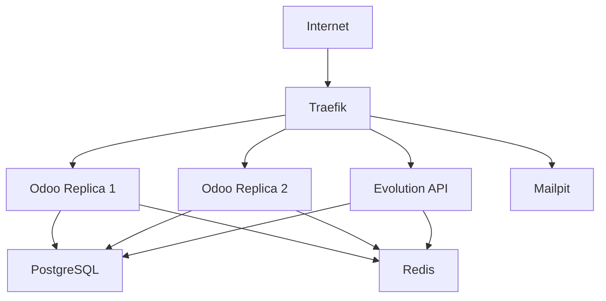

# Discuss Hub - Docker Swarm Deployment 🐳

Esta pasta contém a configuração para deploy do Discuss Hub em um cluster Docker Swarm
com Traefik como proxy reverso.

## 📁 Estrutura de Arquivos

```
docker-swarm/
├── README.md                     # Este arquivo
├── docker-compose.swarm.yml     # Configuração da stack do Swarm
├── .env.example                  # Template de variáveis de ambiente
├── deploy.sh                     # Script de deploy para Linux/macOS
└── deploy.ps1                    # Script de deploy para Windows
```

## 🚀 Quick Start

### 1. Pré-requisitos

- Docker Engine 20.10+
- Docker Swarm mode ativado
- Pelo menos 4GB RAM disponível
- Portas 80, 443 e 8080 disponíveis

### 2. Inicializar Swarm (se necessário)

```bash
# Inicializar cluster Swarm
docker swarm init

# Em ambientes multi-node, usar IP específico:
docker swarm init --advertise-addr YOUR_IP_ADDRESS
```

### 3. Configurar Variáveis

```bash
# Copiar arquivo de exemplo
cp .env.example .env

# Editar configurações (IMPORTANTE!)
nano .env  # Linux/macOS
# ou
notepad .env  # Windows
```

### 4. Deploy da Stack

**Linux/macOS:**

```bash
chmod +x deploy.sh
./deploy.sh
```

**Windows (PowerShell):**

```powershell
.\deploy.ps1
```

## ⚙️ Configuração

### Variáveis de Ambiente Principais

| Variável                       | Descrição                | Padrão              | Produção         |
| ------------------------------ | ------------------------ | ------------------- | ---------------- |
| `DOMAIN`                       | Domínio base             | `localhost`         | `yourdomain.com` |
| `ACME_EMAIL`                   | Email para Let's Encrypt | `admin@example.com` | Seu email real   |
| `POSTGRES_PASSWORD`            | Senha do PostgreSQL      | `admin`             | Senha segura     |
| `ODOO_ADMIN_PASSWORD`          | Senha admin Odoo         | `admin`             | Senha segura     |
| `DISCUSS_HUB_EVOLUTION_APIKEY` | Chave Evolution API      | Padrão              | Sua chave        |

### Configuração para Produção

Edite o arquivo `.env`:

```bash
# Configurações básicas
DOMAIN=yourdomain.com
ACME_EMAIL=your-email@yourdomain.com

# Senhas seguras
POSTGRES_PASSWORD=your-secure-db-password
ODOO_ADMIN_PASSWORD=your-secure-admin-password

# URLs de produção
DISCUSS_HUB_INTERNAL_HOST=https://odoo.yourdomain.com
DISCUSS_HUB_EVOLUTION_URL=https://evolution.yourdomain.com
EVOLUTION_SERVER_URL=https://evolution.yourdomain.com

# API Keys
DISCUSS_HUB_EVOLUTION_APIKEY=your-production-api-key
```

## 🏗️ Arquitetura

### Serviços Inclusos

- **Traefik** - Proxy reverso com SSL automático
- **PostgreSQL** - Banco de dados
- **Redis** - Cache e sessões
- **Odoo** - Aplicação principal (2 réplicas padrão)
- **Evolution API** - Integração WhatsApp
- **Mailpit** - Servidor de email para testes

### Rede e Load Balancing



### Domínios Configurados

Com `DOMAIN=yourdomain.com`:

- **Odoo**: `https://odoo.yourdomain.com` ou `https://yourdomain.com`
- **Evolution API**: `https://evolution.yourdomain.com`
- **Mailpit**: `https://mailpit.yourdomain.com`
- **Traefik Dashboard**: `https://traefik.yourdomain.com`

## 🛠️ Gerenciamento

### Scripts de Deploy

**Comandos Disponíveis:**

```bash
# Deploy da stack
./deploy.sh deploy

# Ver status
./deploy.sh status

# Ver logs
./deploy.sh logs odoo
./deploy.sh logs evolution

# Escalar serviços
./deploy.sh scale odoo 3
./deploy.sh scale evolution 2

# Atualizar serviços
./deploy.sh update odoo
./deploy.sh update

# Remover stack
./deploy.sh remove
```

### Comandos Docker Diretos

```bash
# Ver stacks
docker stack ls

# Ver serviços
docker stack services discuss-hub

# Ver status detalhado
docker service ls
docker service ps discuss-hub_odoo

# Logs de serviço
docker service logs -f discuss-hub_odoo

# Escalar manualmente
docker service scale discuss-hub_odoo=3

# Atualizar imagem
docker service update --image discusshub/discuss_hub:latest discuss-hub_odoo
```

## 📊 Monitoramento

### Health Checks

Todos os serviços têm health checks configurados:

- **PostgreSQL**: `pg_isready`
- **Redis**: `redis-cli ping`
- **Odoo**: HTTP health endpoint
- **Evolution**: HTTP status endpoint

### Verificar Saúde dos Serviços

```bash
# Status geral
docker service ls

# Detalhes de um serviço
docker service ps discuss-hub_odoo

# Logs em tempo real
docker service logs -f discuss-hub_odoo
```

## 🔒 Segurança

### SSL/TLS Automático

- **Let's Encrypt** configurado automaticamente
- **Redirecionamento HTTP → HTTPS**
- **Certificados renovados automaticamente**

### Rede Interna

- Serviços comunicam via rede `internal` isolada
- Apenas Traefik exposto publicamente
- PostgreSQL e Redis não acessíveis externamente

### Senhas e Chaves

⚠️ **IMPORTANTE**: Sempre altere as senhas padrão em produção!

```bash
# Gerar senhas seguras
openssl rand -base64 32  # Para senhas
openssl rand -hex 64     # Para API keys
```

## 🚧 Troubleshooting

### Problemas Comuns

#### 1. Swarm não inicializado

```bash
Error: This node is not a swarm manager
```

**Solução:**

```bash
docker swarm init
```

#### 2. Network traefik não existe

```bash
Error: network traefik not found
```

**Solução:**

```bash
docker network create --driver overlay --attachable traefik
```

#### 3. Serviço não inicia

```bash
# Ver logs detalhados
docker service logs discuss-hub_SERVICO

# Ver eventos
docker service ps discuss-hub_SERVICO --no-trunc
```

#### 4. SSL não funciona

- Verificar se `DOMAIN` e `ACME_EMAIL` estão corretos
- Aguardar alguns minutos para provisionamento inicial
- Ver logs do Traefik: `docker service logs discuss-hub_traefik`

### Logs Importantes

```bash
# Traefik (proxy)
docker service logs -f discuss-hub_traefik

# Odoo (aplicação)
docker service logs -f discuss-hub_odoo

# Evolution (WhatsApp)
docker service logs -f discuss-hub_evolution

# PostgreSQL (banco)
docker service logs -f discuss-hub_db
```

### Reset Completo

```bash
# Remover stack
docker stack rm discuss-hub

# Aguardar limpeza
sleep 30

# Remover volumes (CUIDADO: apaga dados!)
docker volume prune

# Redesplegar
./deploy.sh
```

## 📈 Escalabilidade

### Escalamento Horizontal

```bash
# Escalar Odoo para 5 réplicas
docker service scale discuss-hub_odoo=5

# Escalar Evolution para 2 réplicas
docker service scale discuss-hub_evolution=2
```

### Multi-Node Cluster

Para clusters multi-node:

1. **Join nodes ao cluster:**

```bash
# No manager
docker swarm join-token worker

# Nos workers
docker swarm join --token TOKEN MANAGER_IP:2377
```

2. **Label nodes para constraints:**

```bash
# Dedicar node para banco
docker node update --label-add db=true NODE_ID

# Dedicar node para aplicação
docker node update --label-add app=true NODE_ID
```

3. **Atualizar constraints no compose:**

```yaml
deploy:
  placement:
    constraints:
      - node.labels.app == true
```

## 🔄 Updates e Backup

### Atualizar Aplicação

```bash
# Atualizar imagem do Odoo
docker service update --image discusshub/discuss_hub:v2.0.0 discuss-hub_odoo

# Atualizar toda a stack
./deploy.sh update
```

### Backup de Dados

```bash
# Backup do banco
docker exec $(docker ps -q -f name=discuss-hub_db) \
    pg_dump -U admin postgres > backup_$(date +%Y%m%d).sql

# Backup de volumes
docker run --rm -v discuss-hub_odoo_data:/data \
    -v $(pwd):/backup alpine \
    tar czf /backup/odoo_data_$(date +%Y%m%d).tar.gz -C /data .
```

## 📞 Suporte

- **Issues**: [GitHub Issues](https://github.com/discusshub/discuss_hub/issues)
- **Documentação**: [Docs Principais](../README.md)
- **Docker Swarm**: [Docker Docs](https://docs.docker.com/engine/swarm/)
- **Traefik**: [Traefik Docs](https://doc.traefik.io/traefik/)

---

_Última atualização: 24 de Setembro de 2025_
