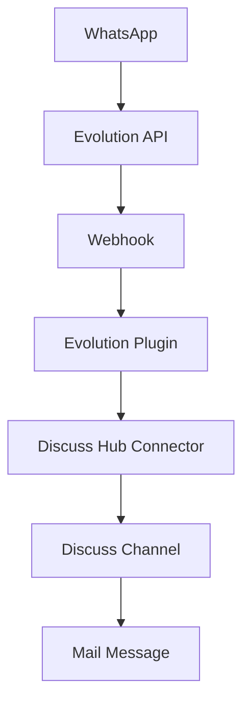

# Evolution Plugin - Documentation 🔥

## 📋 Table of Contents

- [[#Overview]]
- [[#Configuration]]
- [[#Installation]]
- [[#Features]]
- [[#API Methods]]
- [[#Webhooks]]
- [[#Troubleshooting]]
- [[#Examples]]

---

## 📖 Overview

The **Evolution Plugin** is the main integration of Discuss Hub with the Evolution API, allowing you to connect WhatsApp instances to Odoo through a robust and reliable API.

### ✨ Features

- 🔄 **Auto Connection**: Automatic instance management
- 📱 **Dynamic QR Code**: Automatic QR Code generation and updates
- 💬 **Complete Messages**: Text, media, audio, documents
- 👥 **Contact Sync**: Automatic contact import
- ⚡ **Real-time**: Real-time processing via webhooks
- 🔄 **Reactions**: Support for reactions and read status

### 🏗️ Architecture



---

## ⚙️ Configuration

### 🔐 Required Variables

```yaml
# Connector Configuration
name: "my_instance"              # Unique instance name
type: "evolution"                # Plugin type
enabled: true                    # Enable connector
url: "https://api.evolution.com" # Evolution API URL
api_key: "your_token_here"       # Authentication token
```

### 📋 Connector Fields

| Field | Type | Description | Required |
|-------|------|-------------|----------|
| `name` | Char | WhatsApp instance name | ✅ |
| `url` | Char | Evolution API base URL | ✅ |
| `api_key` | Char | Authentication token | ✅ |
| `uuid` | Char | Unique connector UUID | ✅ |
| `enabled` | Boolean | Active/inactive status | ✅ |
| `import_contacts` | Boolean | Auto import contacts | ❌ |

### 🌐 Evolution API Settings

Evolution API should be configured with:

```json
{
    "instance": {
        "name": "my_instance",
        "webhook": {
            "url": "http://your-odoo.com/webhook/discuss_hub/CONNECTOR_UUID",
            "events": [
                "MESSAGES_UPSERT",
                "MESSAGES_UPDATE", 
                "MESSAGES_DELETE",
                "SEND_MESSAGE",
                "CONTACTS_UPSERT",
                "CONTACTS_UPDATE",
                "PRESENCE_UPDATE",
                "CHATS_UPSERT",
                "CHATS_UPDATE",
                "CHATS_DELETE",
                "GROUPS_UPSERT",
                "GROUP_UPDATE",
                "GROUP_PARTICIPANTS_UPDATE",
                "CONNECTION_UPDATE",
                "LABELS_EDIT",
                "LABELS_ASSOCIATION",
                "CALL",
                "TYPEBOT_START",
                "TYPEBOT_CHANGE_STATUS"
            ]
        }
    }
}
```

---

## 🚀 Installation

### 1. **Configure Evolution API**

```bash
# Clone Evolution API
git clone https://github.com/EvolutionAPI/evolution-api.git
cd evolution-api

# Configure environment
cp .env.example .env
# Edit necessary settings

# Start API
docker compose up -d
```

### 2. **Configure Connector in Odoo**

1. Access **Discuss Hub → Connectors**
2. Click **Create**
3. Fill in fields:
   - **Name**: `my_instance`
   - **Type**: `Evolution`
   - **URL**: `https://your-evolution-api.com`
   - **API Key**: `your_token_here`
4. Save and click **Start**

### 3. **Connect WhatsApp**

1. System will automatically generate QR Code
2. Open WhatsApp on phone
3. Go to **Settings → Linked Devices**
4. Scan the displayed QR Code

---

## 🎯 Features

### 📱 Connection Status

The plugin constantly monitors connection status:

- **🟢 open**: Connected and working
- **🟡 connecting**: Connecting to WhatsApp
- **🟠 close**: Disconnected
- **🔴 not_found**: Instance not found

### 💬 Supported Message Types

#### Text
```json
{
    "message_type": "text",
    "message": "Hello! How can I help?",
    "contact_identifier": "5511999999999@c.us"
}
```

#### Media (Image, Video, Audio)
```json
{
    "message_type": "image",
    "media_url": "https://example.com/image.jpg",
    "caption": "Optional caption",
    "contact_identifier": "5511999999999@c.us"
}
```

#### Document
```json
{
    "message_type": "document",
    "media_url": "https://example.com/document.pdf",
    "filename": "document.pdf",
    "contact_identifier": "5511999999999@c.us"
}
```

### 👥 Contact Synchronization

The plugin automatically:
- Imports WhatsApp contacts
- Updates profile pictures
- Syncs names and numbers
- Creates `res.partner` records

### ⚡ Real-time Processing

Automatically processed events:
- Received messages
- Read status
- Reactions
- Contact updates
- Connection status changes

---

## 🔧 API Methods

### Core Methods

#### `get_status()`
Gets current WhatsApp instance status.

```python
status = plugin.get_status()
# Returns:
{
    "status": "open|connecting|close|not_found",
    "qr_code": "data:image/png;base64,iVBOR...", # If needed
    "success": True,
    "plugin_name": "evolution",
    "connector": "my_instance"
}
```

#### `process_payload(payload)`
Processes webhook received from Evolution API.

```python
result = plugin.process_payload(webhook_data)
# Automatically creates channels, messages, contacts
```

#### `outgo_message(channel, message)`
Sends message from Odoo to WhatsApp.

```python
result = plugin.outgo_message(channel, odoo_message)
# Sends via Evolution API
```

### Utility Methods

#### `get_contact_name(payload)`
Extracts contact name from payload.

```python
name = plugin.get_contact_name(payload)
# Returns: "John Silva"
```

#### `get_contact_identifier(payload)`
Extracts unique contact identifier.

```python
identifier = plugin.get_contact_identifier(payload)
# Returns: "5511999999999@c.us"
```

#### `get_message_id(payload)`
Extracts message ID from payload.

```python
msg_id = plugin.get_message_id(payload)
# Returns: "msg_unique_id"
```

### Management Methods

#### `restart_instance()`
Restarts WhatsApp instance.

```python
plugin.restart_instance()
# Forces reconnection
```

#### `logout_instance()`
Disconnects WhatsApp instance.

```python
plugin.logout_instance()
# Disconnects from WhatsApp
```

---

## 🔗 Webhooks

### Endpoint
```
POST /webhook/discuss_hub/<connector_uuid>
```

### Main Events

#### MESSAGES_UPSERT
Message received or sent.

```json
{
    "event": "messages.upsert",
    "instance": "my_instance",
    "data": {
        "key": {
            "remoteJid": "5511999999999@c.us",
            "fromMe": false,
            "id": "msg_123"
        },
        "message": {
            "conversation": "Hello!",
            "messageTimestamp": 1695552000
        },
        "messageType": "conversation",
        "pushName": "John Silva"
    }
}
```

#### CONNECTION_UPDATE
Connection status changed.

```json
{
    "event": "connection.update",
    "instance": "my_instance", 
    "data": {
        "state": "open",
        "statusReason": 200
    }
}
```

#### QRCODE_UPDATED
QR Code updated.

```json
{
    "event": "qrcode.updated",
    "instance": "my_instance",
    "data": {
        "qrcode": "data:image/png;base64,iVBOR..."
    }
}
```

#### CONTACTS_UPSERT
Contacts updated.

```json
{
    "event": "contacts.upsert",
    "instance": "my_instance",
    "data": [
        {
            "id": "5511999999999@c.us",
            "name": "John Silva",
            "profilePictureUrl": "https://..."
        }
    ]
}
```

---

## 🔧 Troubleshooting

### ❌ Common Issues

#### 1. **QR Code not showing**

**Cause**: Instance not created in Evolution API
```python
# Check logs
_logger.info("EVOLUTION: Instance status check")

# Plugin will auto-create if doesn't exist
```

**Solution**:
- Wait a few seconds after creating connector
- Check if URL and API Key are correct
- Confirm Evolution API is accessible

#### 2. **Messages not received**

**Cause**: Webhook not configured
```bash
# Manual webhook test
curl -X POST http://your-odoo.com/webhook/discuss_hub/UUID \
  -H "Content-Type: application/json" \
  -d '{"event": "test", "instance": "my_instance"}'
```

**Solution**:
- Confirm webhook is configured in Evolution API
- Check connector UUID is correct
- Test network connectivity

#### 3. **Status always "not_found"**

**Cause**: Incorrect instance name or API unreachable

```python
# Check configuration
connector_name = self.connector.name  # Should be unique
api_url = self.get_evolution_url()    # Should be accessible
```

**Solution**:
- Confirm instance name is unique
- Test connectivity with Evolution API
- Check Evolution API logs

#### 4. **Contacts not syncing**

**Cause**: `import_contacts` field disabled

**Solution**:
- Enable `import_contacts` in connector
- Force manual sync if needed
- Check API permissions

### 📋 Debug Checklist

- [ ] Evolution API is running and accessible
- [ ] API URL is correct (no trailing slash)
- [ ] API Key is valid and has necessary permissions
- [ ] Instance name is unique
- [ ] Webhook is correctly configured
- [ ] Connector UUID is valid
- [ ] Connector is enabled (`enabled=True`)
- [ ] Network allows bidirectional communication

### 🚨 Important Logs

```python
# Status logs
_logger.info(f"EVOLUTION: Status check for {self.connector.name}")

# Webhook logs
_logger.info(f"EVOLUTION: Received webhook event: {payload.get('event')}")

# Error logs
_logger.error(f"EVOLUTION: API Error {response.status_code}: {response.text}")

# Success logs
_logger.info(f"EVOLUTION: Message sent successfully: {result}")
```

### 🔍 Debug Commands

```bash
# Evolution container status
docker ps | grep evolution

# Evolution API logs
docker logs evolution-api

# Filtered Odoo logs
docker compose logs odoo | grep -i evolution

# Connectivity test
curl -H "apikey: YOUR_TOKEN" https://your-evolution-api.com/instance/status/INSTANCE
```

---

## 📚 Examples

### Example 1: Basic Configuration

```python
# Create connector via code
connector = env['discuss_hub.connector'].create({
    'name': 'whatsapp_sales',
    'type': 'evolution',
    'enabled': True,
    'url': 'https://evolution.company.com',
    'api_key': 'evo_12345abcdef',
    'import_contacts': True
})

# Get plugin and status
plugin = connector.get_plugin()
status = plugin.get_status()
print(f"Status: {status['status']}")
```

### Example 2: Programmatic Message Sending

```python
# Find existing channel
channel = env['discuss.channel'].search([
    ('discuss_hub_connector', '=', connector.id),
    ('discuss_hub_outgoing_destination', '=', '5511999999999@c.us')
])

# Create message
message = env['mail.message'].create({
    'body': '<p>Automated system message</p>',
    'model': 'discuss.channel',
    'res_id': channel.id,
    'message_type': 'comment'
})

# Send via plugin
result = connector.outgo_message(channel, message)
```

### Example 3: Webhook Processing

```python
# Simulate received webhook
webhook_payload = {
    "event": "messages.upsert",
    "instance": "whatsapp_sales",
    "data": {
        "key": {
            "remoteJid": "5511888888888@c.us",
            "fromMe": False,
            "id": "msg_456"
        },
        "message": {
            "conversation": "I need product information",
            "messageTimestamp": 1695552000
        },
        "pushName": "Maria Santos"
    }
}

# Process via plugin
result = connector.process_payload(webhook_payload)
# Automatically creates channel and message in Odoo
```

### Example 4: Manual Contact Sync

```python
# Fetch contacts from Evolution API
plugin = connector.get_plugin()
session = plugin.get_requests_session()
url = f"{plugin.evolution_url}/chat/findContacts/{connector.name}"

response = session.get(url)
if response.status_code == 200:
    contacts = response.json()
    
    for contact in contacts:
        # Process each contact
        plugin.process_contact_upsert({
            'id': contact['id'],
            'name': contact.get('name', contact['id']),
            'profilePictureUrl': contact.get('profilePictureUrl')
        })
```

---

## 🔗 Related Links

- [[Plugin Base|Plugin Base Class]] - Parent class documentation
- [[Connector Model|Connector Model]] - Main model documentation
- [[Webhook API|Webhook API]] - Complete webhook reference
- [[Troubleshooting|Troubleshooting]] - General troubleshooting guide

---

## 📞 Support

- **Evolution API**: [GitHub Evolution API](https://github.com/EvolutionAPI/evolution-api)
- **Documentation**: [Evolution API Docs](https://doc.evolution-api.com)
- **Issues**: [GitHub Issues](https://github.com/discusshub/discuss_hub/issues)
- **Community**: Discuss Hub Community

---
*Last updated: September 24, 2025*