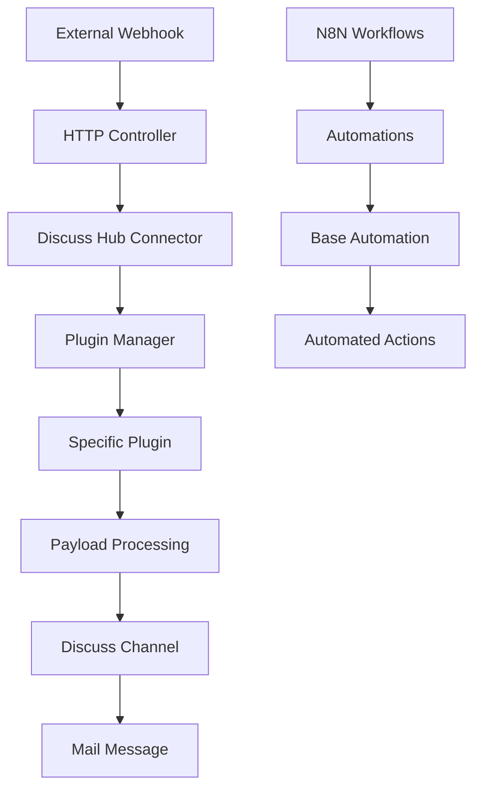

# Discuss Hub - English Documentation 🇺🇸

## 📋 Table of Contents

- [[#Overview]]
- [[#Quick Start]]
- [[#Architecture]]
- [[#Available Plugins]]
- [[#Configuration]]
- [[#Development]]
- [[#API Reference]]
- [[#Troubleshooting]]
- [[#Contributing]]

---

## 📖 Overview

**Discuss Hub** is a framework for integrating third-party message channels into Odoo's Discuss system. It allows connecting different message providers (WhatsApp, Telegram, etc.) through a modular plugin-based architecture.

### ✨ Key Features

- **Modular Architecture**: Extensible plugin system
- **Multi-Platform**: Support for multiple message providers
- **Native Integration**: Fully integrated with Odoo Discuss
- **Automation**: Automation system for message processing
- **Webhooks**: Real-time event processing
- **Unified Interface**: Centralized connector management

### 🎯 Use Cases

- **Customer Service**: Centralize WhatsApp, Telegram conversations, etc.
- **Marketing**: Automated campaigns via multiple channels
- **Sales**: Lead tracking through messages
- **Technical Support**: Tickets integrated with external chats

---

## 🚀 Quick Start

### Prerequisites

- Docker & Docker Compose
- Odoo 18.0+
- N8N (included in compose)

### ⚡ Quick Installation

```bash
# Clone the repository
git clone https://github.com/discusshub/discuss_hub my-project
cd my-project

# Start services
docker compose -f compose-dev.yaml up -d

# Wait for services to start (~30 seconds)
sleep 30

# Load N8N workflows
docker compose -f compose-dev.yaml exec -u node -it n8n sh -c "n8n import:workflow --input=/n8n-workflows.yaml"

# Activate workflows
docker compose -f compose-dev.yaml exec -u node -it n8n sh -c "n8n update:workflow --all --active=true"

# Restart N8N to register workflows
docker compose -f compose-dev.yaml restart n8n
```

### 🎛️ System Access

- **Odoo**: http://localhost:8069/?debug=1
- **N8N**: http://localhost:5678

### 📱 Basic Setup

1. Access **Discuss Hub → Connector**
2. Click **Start**
3. Scan the WhatsApp QR Code

---

## 🏗️ Architecture



### 🧩 Main Components

#### 1. **Connector (`models/models.py`)**
- [[Connector Model|Main model]] that manages connections
- Instantiates and configures plugins
- Processes incoming payloads
- Manages status and settings

#### 2. **Plugins (`models/plugins/`)**
- [[Plugin Base|Base class]] for all plugins
- [[Evolution Plugin|Evolution Plugin]] - WhatsApp via Evolution API  
- [[Example Plugin|Example Plugin]] - Template for new plugins
- [[NotificaMe Plugin|NotificaMe Plugin]] - NotificaMe integration
- [[WhatsApp Cloud Plugin|WhatsApp Cloud Plugin]] - WhatsApp Business API

#### 3. **Controllers (`controllers/`)**
- [[HTTP Controllers|HTTP Controllers]] for webhooks
- External request processing
- Payload validation

#### 4. **Extended Models**
- [[Discuss Channel Model|discuss_channel.py]] - Channel extensions
- [[Mail Message Model|mail_message.py]] - Message processing
- [[Res Partner Model|res_partner.py]] - Contact integration

---

## 🔌 Available Plugins

### [[Evolution Plugin]] 🔥
**Status**: ✅ Production  
**Description**: Evolution API integration for WhatsApp

**Features**:
- Dynamic QR Code
- Send/receive messages
- Contact synchronization
- Media support
- Reactions and status

**Configuration**:
```yaml
type: evolution
url: https://evolution-api.com
api_key: your_api_key
name: my_instance
```

### [[Example Plugin]] 📝
**Status**: 🧪 Development  
**Description**: Example plugin for development

**Usage**: Template for creating new plugins

### [[NotificaMe Plugin]] 📱
**Status**: 🚧 Beta  
**Description**: NotificaMe integration

### [[WhatsApp Cloud Plugin]] ☁️
**Status**: 🚧 Beta  
**Description**: Official WhatsApp Business API

---

## ⚙️ Configuration

### 🔐 Environment Variables

```bash
# Odoo
ODOO_VERSION=18.0
PGUSER=odoo
PGPASSWORD=odoo
PGHOST=db
PGPORT=5432

# N8N
N8N_HOST=n8n
N8N_PORT=5678
WEBHOOK_URL=http://localhost:8069

# Evolution API (optional)
EVOLUTION_API_URL=https://your-evolution-api.com
EVOLUTION_API_KEY=your-api-key
```

### 📋 Connector Settings

| Field | Description | Required |
|-------|-------------|----------|
| `name` | Unique connector name | ✅ |
| `type` | Plugin type | ✅ |
| `enabled` | Active/Inactive | ✅ |
| `url` | External API URL | ⭐ |
| `api_key` | Authentication key | ⭐ |
| `uuid` | Unique identifier | ✅ |

**⭐** = Plugin dependent

### 🛠️ Advanced Settings

#### Base Automations
```xml
<!-- datas/base_automation.xml -->
<record id="base_automation_outgoing_message" model="base.automation">
    <field name="name">Discuss Hub - Outgoing Message</field>
    <field name="model_id" ref="mail.model_mail_message"/>
    <field name="trigger">on_create</field>
</record>
```

#### Custom Views
- `views/views.xml` - Main interface
- `views/res_partner_view.xml` - Contact integration
- `views/templates.xml` - Web templates

---

## 💻 Development

### 🏃‍♂️ Development Environment

```bash
# Clone for development
git clone https://github.com/discusshub/discuss_hub.git
cd discuss_hub

# Development environment
docker compose -f compose-dev.yaml up -d

# Odoo shell
docker compose run --rm odoo odoo shell -d odoo
```

### 🧪 Running Tests

```bash
# All tests
docker compose run --rm odoo odoo \
  --dev=all \
  --db-filter=^test_only\$ \
  -d test_only \
  --stop-after-init \
  --test-enable \
  --without-demo=all \
  -i discuss_hub \
  --test-tags /discuss_hub
```

### 📝 Creating a New Plugin

1. **Create the plugin file**:
```python
# models/plugins/my_plugin.py
from .base import Plugin as PluginBase

class Plugin(PluginBase):
    plugin_name = "my_plugin"
    
    def __init__(self, connector):
        super().__init__(connector)
    
    def get_status(self):
        return {"status": "open"}
    
    def process_payload(self, payload):
        # Your logic here
        pass
```

2. **Register in manifest**:
```python
# __manifest__.py
"depends": ["base", "mail", "base_automation"],
```

3. **Add to selector**:
```python
# models/models.py
type = fields.Selection([
    # ...
    ("my_plugin", "My Plugin"),
])
```

### 🔍 Debug and Logs

```python
import logging
_logger = logging.getLogger(__name__)

# Log levels
_logger.debug("Debug info")
_logger.info("Information")
_logger.warning("Warning")
_logger.error("Error")
```

### 📊 Test Structure

```
tests/
├── README.md              # Test documentation
├── test_base.py          # Base tests
├── test_controller.py    # Controller tests
├── test_example.py       # Example plugin tests
├── test_models.py        # Model tests
├── test_routing_manager.py # Routing tests
└── test_utils.py         # Utility tests
```

---

## 📚 API Reference

### [[Connector API]]

#### Main Methods

##### `get_plugin()`
Returns configured plugin instance
```python
plugin = connector.get_plugin()
```

##### `process_payload(payload)`
Processes payload received via webhook
```python
result = connector.process_payload(webhook_data)
```

##### `outgo_message(channel, message)`
Sends message to external channel
```python
result = connector.outgo_message(channel, message)
```

##### `get_status()`
Gets current connection status
```python
status = connector.get_status()
# Returns: {"status": "open|closed|error", "qr_code": "..."}
```

### [[Plugin Base API]]

#### Required Methods

```python
class Plugin(PluginBase):
    def get_status(self):
        """Returns connection status"""
        pass
    
    def process_payload(self, payload):
        """Processes received payload"""
        pass
    
    def get_message_id(self, payload):
        """Extracts message ID"""
        pass
    
    def get_contact_identifier(self, payload):
        """Extracts contact identifier"""
        pass
    
    def get_contact_name(self, payload):
        """Extracts contact name"""
        pass
```

### [[Webhook API]]

#### Main Endpoint
```
POST /webhook/discuss_hub/<connector_uuid>
```

#### Required Headers
```
Content-Type: application/json
Authorization: Bearer <api_key> (optional)
```

#### Payload Example
```json
{
    "event": "message.received",
    "data": {
        "message_id": "msg_123",
        "contact_identifier": "+5511999999999",
        "contact_name": "John Silva",
        "message_type": "text",
        "message_body": "Hello, I need help!",
        "timestamp": "2025-09-24T10:30:00Z"
    }
}
```

---

## 🔧 Troubleshooting

### ❌ Common Issues

#### 1. **Connector not receiving messages**
```bash
# Check logs
docker compose logs odoo | grep discuss_hub

# Test webhook
curl -X POST http://localhost:8069/webhook/discuss_hub/YOUR_UUID \
  -H "Content-Type: application/json" \
  -d '{"event": "test"}'
```

#### 2. **Plugin not loading**
- Check if plugin is in correct directory
- Confirm `plugin_name` is defined
- Verify imports and dependencies

#### 3. **QR Code not appearing**
- Confirm Evolution API configuration
- Check URL and API Key
- Test manual connection with API

### 📋 Debug Checklist

- [ ] Connector is **enabled**
- [ ] API URL is correct
- [ ] API Key is valid  
- [ ] Connector UUID is unique
- [ ] Webhook is configured in external API
- [ ] Logs show no import errors
- [ ] Plugin implements required methods

### 🚨 Important Logs

```bash
# General logs
docker compose logs -f odoo

# Discuss Hub specific logs
docker compose logs -f odoo | grep "discuss_hub"

# N8N logs
docker compose logs -f n8n

# PostgreSQL logs
docker compose logs -f db
```

---

## 🤝 Contributing

### 📋 Guidelines

1. **Fork** the repository
2. Create a **branch** for your feature: `git checkout -b feature/new-functionality`
3. **Commit** your changes: `git commit -m 'Add: new functionality'`
4. **Push** to branch: `git push origin feature/new-functionality`  
5. Open a **Pull Request**

### 📝 Code Standards

#### Commits
```
feat: adds new functionality
fix: fixes specific bug
docs: updates documentation
test: adds or modifies tests
refactor: refactors code without changing functionality
style: fixes formatting
```

#### Python
- Use **PEP 8**
- Docstrings in **Portuguese** or **English**
- Type hints when possible
- Tests for new functionalities

#### XML/Views
- Indentation of **4 spaces**
- Descriptive IDs with module prefix
- Explanatory comments

### 🧪 Code Quality

```bash
# Pre-commit (without changing README)
SKIP="oca-gen-addon-readme" pre-commit run --all-files

# Pylint
pylint discuss_hub/

# Specific tests
pytest discuss_hub/tests/ -v
```

### 📚 Documentation

- Keep **README.md** updated
- Document new plugins in `docs/`
- Add usage examples
- Use **Obsidian** friendly format with `[[links]]`

---

## 📄 License

This project is licensed under **AGPL-3.0** - see the [LICENSE](../../LICENSE) file for details.

Each module may have a different license - consult each module's `__manifest__.py` file.

---

## 🔗 Related Links

- [[Evolution Plugin|Evolution Plugin]] - Detailed documentation
- [[Plugin Development|Plugin Development]] - Complete guide  
- [[API Reference|API Reference]] - Technical documentation
- [[Troubleshooting|Troubleshooting]] - Problem solving guide
- [[Contributing|Contributing]] - Contribution guide

---

**📞 Support**: [GitHub Issues](https://github.com/discusshub/discuss_hub/issues)  
**🌐 Website**: [https://deepwiki.com/discusshub/discuss_hub](https://deepwiki.com/discusshub/discuss_hub)  
**📧 Community**: Discuss Hub Community

---
*Last updated: September 24, 2025*