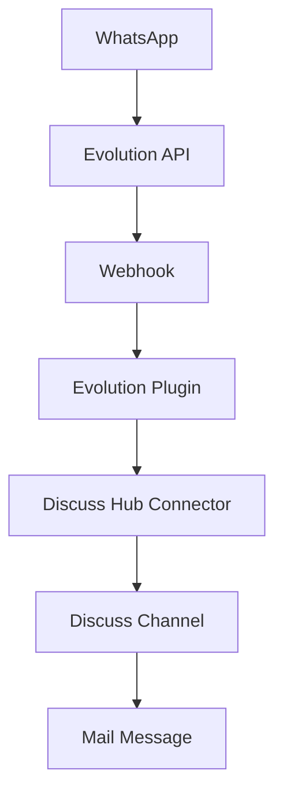

# Evolution Plugin - Documentação 🔥

## 📋 Índice

- [[#Visão Geral]]
- [[#Configuração]]
- [[#Instalação]]
- [[#Funcionalidades]]
- [[#API Methods]]
- [[#Webhooks]]
- [[#Troubleshooting]]
- [[#Exemplos]]

---

## 📖 Visão Geral

O **Evolution Plugin** é a integração principal do Discuss Hub com a Evolution API, permitindo conectar instâncias do WhatsApp ao Odoo através de uma API robusta e confiável.

### ✨ Características

- 🔄 **Conexão Automática**: Gerenciamento automático de instâncias
- 📱 **QR Code Dinâmico**: Geração e atualização automática do QR Code
- 💬 **Mensagens Completas**: Texto, mídia, áudio, documentos
- 👥 **Sincronização de Contatos**: Import automático de contatos
- ⚡ **Real-time**: Processamento em tempo real via webhooks
- 🔄 **Reações**: Suporte a reações e status de leitura

### 🏗️ Arquitetura



---

## ⚙️ Configuração

### 🔐 Variáveis Necessárias

```yaml
# Connector Configuration
name: "minha_instancia"          # Nome único da instância
type: "evolution"                # Tipo do plugin
enabled: true                    # Ativar connector
url: "https://api.evolution.com" # URL da Evolution API
api_key: "seu_token_aqui"        # Token de autenticação
```

### 📋 Campos do Connector

| Campo | Tipo | Descrição | Obrigatório |
|-------|------|-----------|-------------|
| `name` | Char | Nome da instância WhatsApp | ✅ |
| `url` | Char | URL base da Evolution API | ✅ |
| `api_key` | Char | Token de autenticação | ✅ |
| `uuid` | Char | UUID único do connector | ✅ |
| `enabled` | Boolean | Status ativo/inativo | ✅ |
| `import_contacts` | Boolean | Importar contatos automaticamente | ❌ |

### 🌐 Evolution API Settings

A Evolution API deve estar configurada com:

```json
{
    "instance": {
        "name": "minha_instancia",
        "webhook": {
            "url": "http://seu-odoo.com/webhook/discuss_hub/UUID_CONNECTOR",
            "events": [
                "MESSAGES_UPSERT",
                "MESSAGES_UPDATE", 
                "MESSAGES_DELETE",
                "SEND_MESSAGE",
                "CONTACTS_UPSERT",
                "CONTACTS_UPDATE",
                "PRESENCE_UPDATE",
                "CHATS_UPSERT",
                "CHATS_UPDATE",
                "CHATS_DELETE",
                "GROUPS_UPSERT",
                "GROUP_UPDATE",
                "GROUP_PARTICIPANTS_UPDATE",
                "CONNECTION_UPDATE",
                "LABELS_EDIT",
                "LABELS_ASSOCIATION",
                "CALL",
                "TYPEBOT_START",
                "TYPEBOT_CHANGE_STATUS"
            ]
        }
    }
}
```

---

## 🚀 Instalação

### 1. **Configure a Evolution API**

```bash
# Clone da Evolution API
git clone https://github.com/EvolutionAPI/evolution-api.git
cd evolution-api

# Configure environment
cp .env.example .env
# Edite as configurações necessárias

# Inicie a API
docker compose up -d
```

### 2. **Configure o Connector no Odoo**

1. Acesse **Discuss Hub → Connectors**
2. Clique em **Criar**
3. Preencha os campos:
   - **Nome**: `minha_instancia`
   - **Tipo**: `Evolution`
   - **URL**: `https://sua-evolution-api.com`
   - **API Key**: `seu_token_aqui`
4. Salve e clique em **Start**

### 3. **Conecte o WhatsApp**

1. O sistema gerará um QR Code automaticamente
2. Abra o WhatsApp no celular
3. Vá em **Configurações → Dispositivos Conectados**
4. Escaneie o QR Code exibido

---

## 🎯 Funcionalidades

### 📱 Status da Conexão

O plugin monitora constantemente o status da conexão:

- **🟢 open**: Conectado e funcionando
- **🟡 connecting**: Conectando ao WhatsApp
- **🟠 close**: Desconectado
- **🔴 not_found**: Instância não encontrada

### 💬 Tipos de Mensagem Suportados

#### Texto
```json
{
    "message_type": "text",
    "message": "Olá! Como posso ajudar?",
    "contact_identifier": "5511999999999@c.us"
}
```

#### Mídia (Imagem, Vídeo, Áudio)
```json
{
    "message_type": "image",
    "media_url": "https://exemplo.com/imagem.jpg",
    "caption": "Legenda opcional",
    "contact_identifier": "5511999999999@c.us"
}
```

#### Documento
```json
{
    "message_type": "document",
    "media_url": "https://exemplo.com/documento.pdf",
    "filename": "documento.pdf",
    "contact_identifier": "5511999999999@c.us"
}
```

### 👥 Sincronização de Contatos

O plugin automaticamente:
- Importa contatos do WhatsApp
- Atualiza fotos de perfil
- Sincroniza nomes e números
- Cria registros de `res.partner`

### ⚡ Processamento em Tempo Real

Eventos processados automaticamente:
- Mensagens recebidas
- Status de leitura
- Reações
- Atualizações de contato
- Mudanças de status da conexão

---

## 🔧 API Methods

### Core Methods

#### `get_status()`
Obtém o status atual da instância WhatsApp.

```python
status = plugin.get_status()
# Returns:
{
    "status": "open|connecting|close|not_found",
    "qr_code": "data:image/png;base64,iVBOR...", # Se necessário
    "success": True,
    "plugin_name": "evolution",
    "connector": "minha_instancia"
}
```

#### `process_payload(payload)`
Processa webhook recebido da Evolution API.

```python
result = plugin.process_payload(webhook_data)
# Automaticamente cria canais, mensagens, contatos
```

#### `outgo_message(channel, message)`
Envia mensagem do Odoo para WhatsApp.

```python
result = plugin.outgo_message(channel, odoo_message)
# Envia via Evolution API
```

### Utility Methods

#### `get_contact_name(payload)`
Extrai nome do contato do payload.

```python
name = plugin.get_contact_name(payload)
# Returns: "João Silva"
```

#### `get_contact_identifier(payload)`
Extrai identificador único do contato.

```python
identifier = plugin.get_contact_identifier(payload)
# Returns: "5511999999999@c.us"
```

#### `get_message_id(payload)`
Extrai ID da mensagem do payload.

```python
msg_id = plugin.get_message_id(payload)
# Returns: "msg_unique_id"
```

### Management Methods

#### `restart_instance()`
Reinicia a instância WhatsApp.

```python
plugin.restart_instance()
# Força reconexão
```

#### `logout_instance()`
Desconecta a instância WhatsApp.

```python
plugin.logout_instance()
# Desconecta do WhatsApp
```

---

## 🔗 Webhooks

### Endpoint
```
POST /webhook/discuss_hub/<connector_uuid>
```

### Eventos Principais

#### MESSAGES_UPSERT
Mensagem recebida ou enviada.

```json
{
    "event": "messages.upsert",
    "instance": "minha_instancia",
    "data": {
        "key": {
            "remoteJid": "5511999999999@c.us",
            "fromMe": false,
            "id": "msg_123"
        },
        "message": {
            "conversation": "Olá!",
            "messageTimestamp": 1695552000
        },
        "messageType": "conversation",
        "pushName": "João Silva"
    }
}
```

#### CONNECTION_UPDATE
Status da conexão alterado.

```json
{
    "event": "connection.update",
    "instance": "minha_instancia", 
    "data": {
        "state": "open",
        "statusReason": 200
    }
}
```

#### QRCODE_UPDATED
QR Code atualizado.

```json
{
    "event": "qrcode.updated",
    "instance": "minha_instancia",
    "data": {
        "qrcode": "data:image/png;base64,iVBOR..."
    }
}
```

#### CONTACTS_UPSERT
Contatos atualizados.

```json
{
    "event": "contacts.upsert",
    "instance": "minha_instancia",
    "data": [
        {
            "id": "5511999999999@c.us",
            "name": "João Silva",
            "profilePictureUrl": "https://..."
        }
    ]
}
```

---

## 🔧 Troubleshooting

### ❌ Problemas Comuns

#### 1. **QR Code não aparece**

**Causa**: Instância não criada na Evolution API
```python
# Verificar logs
_logger.info("EVOLUTION: Instance status check")

# O plugin criará automaticamente se não existir
```

**Solução**:
- Aguarde alguns segundos após criar o connector
- Verifique se URL e API Key estão corretos
- Confirme que a Evolution API está acessível

#### 2. **Mensagens não são recebidas**

**Causa**: Webhook não configurado
```bash
# Teste manual do webhook
curl -X POST http://seu-odoo.com/webhook/discuss_hub/UUID \
  -H "Content-Type: application/json" \
  -d '{"event": "test", "instance": "minha_instancia"}'
```

**Solução**:
- Confirme que o webhook está configurado na Evolution API
- Verifique se o UUID do connector está correto
- Teste a conectividade de rede

#### 3. **Status sempre "not_found"**

**Causa**: Nome da instância incorreto ou API inacessível

```python
# Verificar configuração
connector_name = self.connector.name  # Deve ser único
api_url = self.get_evolution_url()    # Deve estar acessível
```

**Solução**:
- Confirme que o nome da instância é único
- Teste conectividade com a Evolution API
- Verifique logs da Evolution API

#### 4. **Contatos não sincronizam**

**Causa**: Campo `import_contacts` desabilitado

**Solução**:
- Habilite `import_contacts` no connector
- Force sincronização manual se necessário
- Verifique permissões da API

### 📋 Debug Checklist

- [ ] Evolution API está rodando e acessível
- [ ] URL da API está correta (sem trailing slash)
- [ ] API Key é válida e tem permissões necessárias
- [ ] Nome da instância é único
- [ ] Webhook está configurado corretamente
- [ ] UUID do connector é válido
- [ ] Connector está habilitado (`enabled=True`)
- [ ] Rede permite comunicação bidirecional

### 🚨 Logs Importantes

```python
# Logs de status
_logger.info(f"EVOLUTION: Status check for {self.connector.name}")

# Logs de webhook
_logger.info(f"EVOLUTION: Received webhook event: {payload.get('event')}")

# Logs de erro
_logger.error(f"EVOLUTION: API Error {response.status_code}: {response.text}")

# Logs de sucesso
_logger.info(f"EVOLUTION: Message sent successfully: {result}")
```

### 🔍 Comandos de Debug

```bash
# Status do container Evolution
docker ps | grep evolution

# Logs da Evolution API
docker logs evolution-api

# Logs do Odoo filtrados
docker compose logs odoo | grep -i evolution

# Teste de conectividade
curl -H "apikey: SEU_TOKEN" https://sua-evolution-api.com/instance/status/INSTANCIA
```

---

## 📚 Exemplos

### Exemplo 1: Configuração Básica

```python
# Criar connector via código
connector = env['discuss_hub.connector'].create({
    'name': 'whatsapp_vendas',
    'type': 'evolution',
    'enabled': True,
    'url': 'https://evolution.empresa.com',
    'api_key': 'evo_12345abcdef',
    'import_contacts': True
})

# Obter plugin e status
plugin = connector.get_plugin()
status = plugin.get_status()
print(f"Status: {status['status']}")
```

### Exemplo 2: Envio de Mensagem Programática

```python
# Buscar canal existente
channel = env['discuss.channel'].search([
    ('discuss_hub_connector', '=', connector.id),
    ('discuss_hub_outgoing_destination', '=', '5511999999999@c.us')
])

# Criar mensagem
message = env['mail.message'].create({
    'body': '<p>Mensagem automática do sistema</p>',
    'model': 'discuss.channel',
    'res_id': channel.id,
    'message_type': 'comment'
})

# Enviar via plugin
result = connector.outgo_message(channel, message)
```

### Exemplo 3: Processamento de Webhook

```python
# Simulação de webhook recebido
webhook_payload = {
    "event": "messages.upsert",
    "instance": "whatsapp_vendas",
    "data": {
        "key": {
            "remoteJid": "5511888888888@c.us",
            "fromMe": False,
            "id": "msg_456"
        },
        "message": {
            "conversation": "Preciso de informações sobre produtos",
            "messageTimestamp": 1695552000
        },
        "pushName": "Maria Santos"
    }
}

# Processar via plugin
result = connector.process_payload(webhook_payload)
# Automaticamente cria canal e mensagem no Odoo
```

### Exemplo 4: Sincronização Manual de Contatos

```python
# Buscar contatos da Evolution API
plugin = connector.get_plugin()
session = plugin.get_requests_session()
url = f"{plugin.evolution_url}/chat/findContacts/{connector.name}"

response = session.get(url)
if response.status_code == 200:
    contacts = response.json()
    
    for contact in contacts:
        # Processar cada contato
        plugin.process_contact_upsert({
            'id': contact['id'],
            'name': contact.get('name', contact['id']),
            'profilePictureUrl': contact.get('profilePictureUrl')
        })
```

---

## 🔗 Links Relacionados

- [[Plugin Base|Classe Base dos Plugins]] - Documentação da classe pai
- [[Connector Model|Modelo Connector]] - Documentação do modelo principal
- [[Webhook API|API de Webhooks]] - Referência completa de webhooks
- [[Troubleshooting|Solução de Problemas]] - Guia geral de solução

---

## 📞 Suporte

- **Evolution API**: [GitHub Evolution API](https://github.com/EvolutionAPI/evolution-api)
- **Documentação**: [Evolution API Docs](https://doc.evolution-api.com)
- **Issues**: [GitHub Issues](https://github.com/discusshub/discuss_hub/issues)
- **Comunidade**: Discuss Hub Community

---
*Última atualização: 24 de Setembro de 2025*