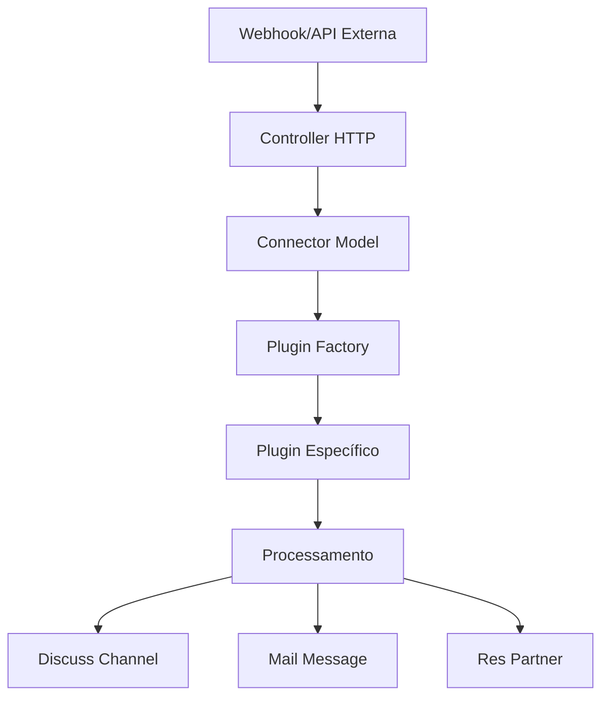

# Desenvolvimento de Plugins - Guia Completo 🛠️

## 📋 Índice

- [[#Introdução]]
- [[#Arquitetura de Plugins]]
- [[#Classe Base]]
- [[#Criando um Novo Plugin]]
- [[#Métodos Obrigatórios]]
- [[#Métodos Opcionais]]
- [[#Processamento de Payload]]
- [[#Integração com Odoo]]
- [[#Testes]]
- [[#Deployment]]
- [[#Melhores Práticas]]

---

## 📖 Introdução

O sistema de plugins do Discuss Hub permite integrar qualquer serviço de mensagens externo ao Odoo de forma modular e extensível. Cada plugin é uma classe Python que herda de `PluginBase` e implementa métodos específicos para o provedor de mensagens.

### 🎯 Objetivos dos Plugins

- **Modularidade**: Cada provedor em um plugin separado
- **Padronização**: Interface comum para todos os plugins
- **Extensibilidade**: Fácil adição de novos provedores
- **Manutenibilidade**: Código organizado e testável

### 🏗️ Arquitetura



---

## 🧩 Arquitetura de Plugins

### 📁 Estrutura de Diretórios

```
models/plugins/
├── __init__.py           # Inicialização do módulo
├── base.py              # Classe base para todos os plugins
├── evolution.py         # Plugin Evolution API
├── example.py           # Plugin exemplo/template
├── notificame.py        # Plugin NotificaMe
├── whatsapp_cloud.py    # Plugin WhatsApp Business API
└── my_new_plugin.py     # Seu novo plugin
```

### 🔄 Fluxo de Funcionamento

1. **Webhook** recebido pelo controller
2. **Connector** identifica o plugin pelo campo `type`
3. **Plugin Factory** instancia o plugin apropriado
4. **Plugin** processa o payload
5. **Resultado** é persistido no Odoo

---

## 🏛️ Classe Base

### 📝 `PluginBase` (`models/plugins/base.py`)

Todos os plugins herdam desta classe base:

```python
class Plugin:
    """Base class for all plugins."""
    
    name = os.path.basename(__file__).split(".")[0]
    
    def __init__(self, connector):
        """Initialize with connector instance."""
        self.connector = connector
        
    # Métodos abstratos que devem ser implementados
    def process_payload(self, payload):
        raise NotImplementedError()
    
    def get_status(self):
        raise NotImplementedError()
        
    def get_message_id(self, payload):
        raise NotImplementedError()
        
    def get_contact_name(self, payload):
        raise NotImplementedError()
        
    def get_contact_identifier(self, payload):
        raise NotImplementedError()
```

### 🛠️ Utilitários Disponíveis

A classe base fornece utilitários comuns:

```python
# Logging
import logging
_logger = logging.getLogger(__name__)

# Acesso ao Odoo environment
self.connector.env  # Environment do Odoo

# Configurações do connector
self.connector.name      # Nome da instância
self.connector.api_key   # Token de API
self.connector.url       # URL base da API
self.connector.enabled   # Status ativo/inativo
```

---

## 🆕 Criando um Novo Plugin

### 1. **Estrutura Básica**

Crie o arquivo `models/plugins/meu_plugin.py`:

```python
import logging
from .base import Plugin as PluginBase

_logger = logging.getLogger(__name__)

class Plugin(PluginBase):
    plugin_name = "meu_plugin"
    
    def __init__(self, connector):
        """Inicializa o plugin com o connector."""
        super().__init__(connector)
        
        # Configurações específicas do plugin
        self.api_url = connector.url
        self.api_key = connector.api_key
        self.session = self._get_requests_session()
    
    def _get_requests_session(self):
        """Cria sessão requests com autenticação."""
        import requests
        session = requests.Session()
        session.headers.update({
            'Authorization': f'Bearer {self.api_key}',
            'Content-Type': 'application/json'
        })
        return session
```

### 2. **Registrar no Selector**

Adicione ao `models/models.py`:

```python
type = fields.Selection([
    ("base", "Base Plugin"),
    ("example", "Example Plugin"), 
    ("evolution", "Evolution"),
    ("meu_plugin", "Meu Plugin"),  # Adicionar aqui
    # ...
])
```

### 3. **Atualizar Manifest**

No `__manifest__.py`, certifique-se que o plugin está incluído:

```python
"depends": ["base", "mail", "base_automation"],
# Plugins são carregados automaticamente do diretório
```

---

## ✅ Métodos Obrigatórios

### `get_status()`

Retorna o status atual da conexão:

```python
def get_status(self):
    """Obtém status da conexão com o provedor."""
    try:
        response = self.session.get(f"{self.api_url}/status")
        if response.status_code == 200:
            data = response.json()
            return {
                "status": "open",  # open|closed|connecting|error
                "success": True,
                "plugin_name": self.plugin_name,
                "connector": str(self.connector),
                # Campos opcionais
                "qr_code": data.get("qr_code"),
                "has_restart": True,
                "has_close": True,
            }
    except Exception as e:
        _logger.error(f"Error getting status: {e}")
        return {
            "status": "error",
            "success": False,
            "error": str(e)
        }
```

### `process_payload(payload)`

Processa webhook/payload recebido:

```python
def process_payload(self, payload):
    """Processa payload recebido do webhook."""
    try:
        event_type = payload.get("event", payload.get("type"))
        
        if event_type == "message":
            return self._process_message(payload)
        elif event_type == "status":
            return self._process_status_update(payload)
        elif event_type == "contact":
            return self._process_contact_update(payload)
        else:
            _logger.warning(f"Unhandled event type: {event_type}")
            return {"success": False, "error": "Unknown event type"}
            
    except Exception as e:
        _logger.error(f"Error processing payload: {e}")
        return {"success": False, "error": str(e)}
```

### `get_message_id(payload)`

Extrai ID único da mensagem:

```python
def get_message_id(self, payload):
    """Extrai ID da mensagem do payload."""
    # Adapte conforme estrutura da sua API
    return (
        payload.get("message_id") or
        payload.get("id") or 
        payload.get("data", {}).get("id")
    )
```

### `get_contact_name(payload)`

Extrai nome do contato:

```python
def get_contact_name(self, payload):
    """Extrai nome do contato do payload."""
    return (
        payload.get("contact_name") or
        payload.get("from_name") or
        payload.get("data", {}).get("name") or
        "Unknown Contact"
    )
```

### `get_contact_identifier(payload)`

Extrai identificador único do contato:

```python
def get_contact_identifier(self, payload):
    """Extrai identificador único do contato."""
    return (
        payload.get("contact_id") or
        payload.get("from") or
        payload.get("data", {}).get("phone") or
        payload.get("data", {}).get("id")
    )
```

---

## 🔧 Métodos Opcionais

### `get_channel_name(payload)`

Gera nome para o canal no Discuss:

```python
def get_channel_name(self, payload):
    """Gera nome do canal baseado no payload."""
    contact_name = self.get_contact_name(payload)
    contact_id = self.get_contact_identifier(payload)
    return f"{contact_name} <{contact_id}>"
```

### `outgo_message(channel, message)`

Envia mensagem para o provedor externo:

```python
def outgo_message(self, channel, message):
    """Envia mensagem do Odoo para o provedor externo."""
    try:
        # Extrair destinatário do canal
        destination = channel.discuss_hub_outgoing_destination
        
        # Preparar dados da mensagem
        data = {
            "to": destination,
            "message": self._extract_text_from_html(message.body),
            "type": "text"
        }
        
        # Enviar via API
        response = self.session.post(
            f"{self.api_url}/send-message",
            json=data
        )
        
        if response.status_code == 200:
            result = response.json()
            _logger.info(f"Message sent: {result}")
            return result
        else:
            _logger.error(f"Send failed: {response.text}")
            return None
            
    except Exception as e:
        _logger.error(f"Error sending message: {e}")
        return None
```

### `restart_instance()` e `logout_instance()`

Gerenciamento da instância:

```python
def restart_instance(self):
    """Reinicia a instância da conexão."""
    try:
        response = self.session.post(f"{self.api_url}/restart")
        return response.status_code == 200
    except Exception as e:
        _logger.error(f"Restart failed: {e}")
        return False

def logout_instance(self):
    """Desconecta a instância."""
    try:
        response = self.session.post(f"{self.api_url}/logout")
        return response.status_code == 200
    except Exception as e:
        _logger.error(f"Logout failed: {e}")
        return False
```

---

## 📦 Processamento de Payload

### Estrutura Típica de Processamento

```python
def _process_message(self, payload):
    """Processa mensagem recebida."""
    
    # 1. Extrair informações básicas
    message_id = self.get_message_id(payload)
    contact_name = self.get_contact_name(payload)
    contact_identifier = self.get_contact_identifier(payload)
    message_text = self._extract_message_text(payload)
    
    # 2. Buscar ou criar contato
    partner = self._find_or_create_partner(
        contact_identifier, 
        contact_name, 
        payload
    )
    
    # 3. Buscar ou criar canal
    channel = self._find_or_create_channel(
        contact_identifier,
        partner,
        payload
    )
    
    # 4. Criar mensagem no Odoo
    message = self._create_message(
        channel,
        message_text,
        partner,
        payload
    )
    
    return {
        "success": True,
        "partner_id": partner.id,
        "channel_id": channel.id,
        "message_id": message.id
    }
```

### Utilitários de Processamento

```python
def _find_or_create_partner(self, identifier, name, payload):
    """Busca ou cria partner para o contato."""
    Partner = self.connector.env["res.partner"]
    
    # Buscar por campo configurado no connector
    field_name = self.connector.partner_contact_field or "phone"
    domain = [(field_name, "=", identifier)]
    
    partner = Partner.search(domain, limit=1)
    if not partner:
        partner = Partner.create({
            "name": name,
            field_name: identifier,
            "is_company": False,
        })
        
        # Atualizar foto se disponível
        profile_pic = self._get_profile_picture(payload)
        if profile_pic:
            partner.image_1920 = profile_pic
    
    return partner

def _find_or_create_channel(self, identifier, partner, payload):
    """Busca ou cria canal para a conversa."""
    Channel = self.connector.env["discuss.channel"]
    
    channel = Channel.search([
        ("discuss_hub_connector", "=", self.connector.id),
        ("discuss_hub_outgoing_destination", "=", identifier)
    ], limit=1)
    
    if not channel:
        channel = Channel.create({
            "name": self.get_channel_name(payload),
            "discuss_hub_connector": self.connector.id,
            "discuss_hub_outgoing_destination": identifier,
            "channel_partner_ids": [(4, partner.id)],
        })
    
    return channel

def _create_message(self, channel, text, partner, payload):
    """Cria mensagem no canal."""
    Message = self.connector.env["mail.message"]
    
    return Message.create({
        "body": f"<p>{text}</p>",
        "model": "discuss.channel", 
        "res_id": channel.id,
        "message_type": "comment",
        "author_id": partner.id,
        "discuss_hub_message_id": self.get_message_id(payload),
    })
```

---

## 🔗 Integração com Odoo

### Models Disponíveis

```python
# Via connector environment
env = self.connector.env

# Principais models
Partner = env["res.partner"]         # Contatos
Channel = env["discuss.channel"]     # Canais de conversa  
Message = env["mail.message"]        # Mensagens
Attachment = env["ir.attachment"]    # Anexos
```

### Campos Customizados

O Discuss Hub adiciona campos específicos aos models do Odoo:

#### `discuss.channel`
```python
discuss_hub_connector = fields.Many2one("discuss_hub.connector")
discuss_hub_outgoing_destination = fields.Char()  # ID do chat externo
```

#### `mail.message`  
```python
discuss_hub_message_id = fields.Char()  # ID da mensagem externa
```

#### `res.partner`
```python
# Campo configurável no connector para identificar contatos
# Pode ser phone, email, mobile, etc.
```

### Automações Base

O sistema inclui automações que disparam quando:
- Nova mensagem é criada no canal
- Status do connector muda
- Contato é atualizado

---

## 🧪 Testes

### Estrutura de Testes

Crie `tests/test_meu_plugin.py`:

```python
import unittest
from unittest.mock import patch, MagicMock
from odoo.tests import tagged
from odoo.tests.common import TransactionCase

@tagged("discuss_hub", "meu_plugin") 
class TestMeuPlugin(TransactionCase):
    
    @classmethod
    def setUpClass(cls):
        super().setUpClass()
        
        # Criar connector de teste
        cls.connector = cls.env["discuss_hub.connector"].create({
            "name": "test_meu_plugin",
            "type": "meu_plugin",
            "enabled": True,
            "url": "https://api.test.com",
            "api_key": "test_key",
        })
    
    def test_get_status(self):
        """Testa obtenção de status."""
        plugin = self.connector.get_plugin()
        
        with patch.object(plugin.session, 'get') as mock_get:
            mock_get.return_value.status_code = 200
            mock_get.return_value.json.return_value = {"status": "connected"}
            
            result = plugin.get_status()
            
            self.assertEqual(result["status"], "open")
            self.assertTrue(result["success"])
    
    @patch("requests.Session.post")
    def test_outgo_message(self, mock_post):
        """Testa envio de mensagem."""
        mock_post.return_value.status_code = 200
        mock_post.return_value.json.return_value = {"id": "msg_123"}
        
        # Criar canal e mensagem de teste
        channel = self.env["discuss.channel"].create({
            "name": "Test Channel",
            "discuss_hub_connector": self.connector.id,
            "discuss_hub_outgoing_destination": "test_contact",
        })
        
        message = self.env["mail.message"].create({
            "body": "<p>Test message</p>",
            "model": "discuss.channel",
            "res_id": channel.id,
        })
        
        plugin = self.connector.get_plugin()
        result = plugin.outgo_message(channel, message)
        
        self.assertIsNotNone(result)
        mock_post.assert_called_once()
```

### Executando Testes

```bash
# Teste específico do plugin
docker compose run --rm odoo odoo \
  --test-enable \
  --test-tags /discuss_hub/meu_plugin \
  -d test_db --stop-after-init

# Todos os testes do discuss_hub
docker compose run --rm odoo odoo \
  --test-enable \
  --test-tags /discuss_hub \
  -d test_db --stop-after-init
```

---

## 🚀 Deployment

### 1. **Validação Pre-Deploy**

```bash
# Linting
pylint discuss_hub/models/plugins/meu_plugin.py

# Testes
python -m pytest discuss_hub/tests/test_meu_plugin.py -v

# Pre-commit hooks
pre-commit run --all-files
```

### 2. **Instalação em Produção**

```bash
# Atualizar módulo
./odoo-bin -u discuss_hub -d production_db

# Verificar logs
tail -f /var/log/odoo/odoo-server.log | grep meu_plugin
```

### 3. **Configuração do Connector**

1. Acessar **Discuss Hub → Connectors**
2. Criar novo connector com tipo "Meu Plugin"
3. Configurar URL, API Key, etc.
4. Testar conexão e webhook

---

## 💡 Melhores Práticas

### 🔐 Segurança

```python
# Sempre validar entrada
def process_payload(self, payload):
    if not isinstance(payload, dict):
        raise ValueError("Payload must be dict")
    
    # Sanitizar dados
    message_text = self._sanitize_text(payload.get("message", ""))
    
# Usar HTTPS sempre
def _get_requests_session(self):
    session = requests.Session()
    session.verify = True  # Verificar certificados SSL
    return session

# Não logar informações sensíveis  
_logger.info(f"Processing message for {contact_name}")  # ✅
_logger.debug(f"API Key: {self.api_key}")              # ❌
```

### ⚡ Performance

```python
# Cache de sessões HTTP
@property
def session(self):
    if not hasattr(self, '_session'):
        self._session = self._get_requests_session()
    return self._session

# Processamento em lote
def process_multiple_messages(self, messages):
    for batch in self._chunk_list(messages, 50):
        self._process_message_batch(batch)

# Timeouts apropriados
response = self.session.get(url, timeout=10)
```

### 📝 Documentação

```python
class Plugin(PluginBase):
    """Plugin para integração com MeuProvedor API.
    
    Este plugin permite conectar o Discuss Hub com a API do MeuProvedor,
    suportando envio e recebimento de mensagens de texto e mídia.
    
    Configuração necessária:
        - url: URL base da API (ex: https://api.meuprovedor.com)
        - api_key: Token de autenticação
        
    Eventos suportados:
        - message: Mensagem recebida/enviada
        - status: Mudança de status da conexão
        - contact: Atualização de contato
    """
    
    def get_status(self):
        """Obtém status atual da conexão.
        
        Returns:
            dict: Status da conexão com campos:
                - status (str): open|closed|connecting|error
                - success (bool): Se a operação foi bem-sucedida
                - qr_code (str, optional): QR Code para autenticação
        """
```

### 🐛 Error Handling

```python
def process_payload(self, payload):
    """Processa payload com tratamento robusto de erros."""
    try:
        # Validação inicial
        if not payload or not isinstance(payload, dict):
            raise ValueError("Invalid payload format")
        
        # Processamento principal
        return self._process_main_logic(payload)
        
    except requests.RequestException as e:
        _logger.error(f"Network error processing payload: {e}")
        return {"success": False, "error": "Network error"}
        
    except ValueError as e:
        _logger.warning(f"Invalid payload: {e}")
        return {"success": False, "error": "Invalid data"}
        
    except Exception as e:
        _logger.exception(f"Unexpected error: {e}")
        return {"success": False, "error": "Internal error"}
```

### 🔄 Versionamento

```python
class Plugin(PluginBase):
    plugin_name = "meu_plugin"
    version = "1.0.0"
    
    def get_status(self):
        status = self._get_base_status()
        status.update({
            "plugin_version": self.version,
            "api_version": self._get_api_version()
        })
        return status
```

---

## 🔗 Links Relacionados

- [[Plugin Base|Classe Base]] - Documentação da classe pai
- [[Evolution Plugin|Plugin Evolution]] - Exemplo de plugin completo  
- [[Example Plugin|Plugin Exemplo]] - Template básico
- [[API Reference|API Reference]] - Referência completa da API
- [[Testing Guide|Guia de Testes]] - Como testar plugins

---

## 📞 Suporte

- **Issues**: [GitHub Issues](https://github.com/discusshub/discuss_hub/issues)
- **Discussões**: [GitHub Discussions](https://github.com/discusshub/discuss_hub/discussions)
- **Comunidade**: Discuss Hub Community
- **Documentação**: [DeepWiki](https://deepwiki.com/discusshub/discuss_hub)

---
*Última atualização: 24 de Setembro de 2025*