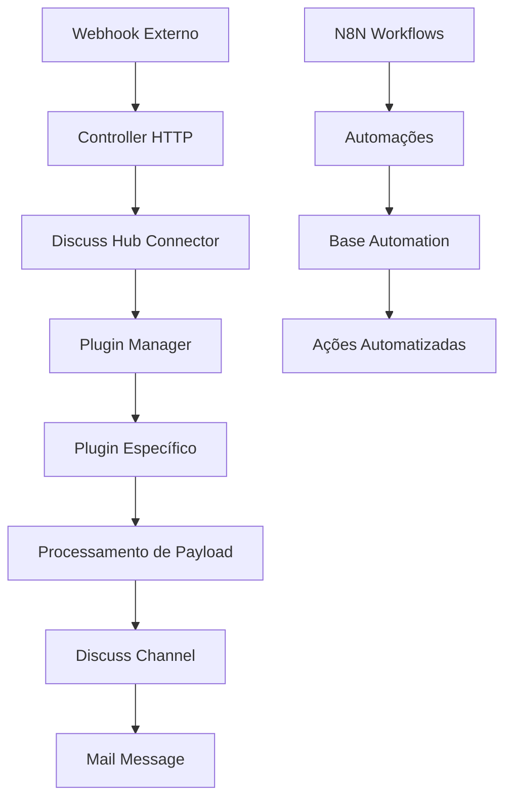

# Discuss Hub - Documentação em Português 🇧🇷

## 📋 Índice

- [[#Visão Geral]]
- [[#Início Rápido]]
- [[#Arquitetura]]
- [[#Plugins Disponíveis]]
- [[#Configuração]]
- [[#Desenvolvimento]]
- [[#API Reference]]
- [[#Troubleshooting]]
- [[#Contribuição]]

---

## 📖 Visão Geral

O **Discuss Hub** é um framework para integração de canais de mensagens de terceiros no
sistema Discuss do Odoo. Permite conectar diferentes provedores de mensagens (WhatsApp,
Telegram, etc.) através de uma arquitetura modular baseada em plugins.

### ✨ Principais Características

- **Arquitetura Modular**: Sistema de plugins extensível
- **Multi-Plataforma**: Suporte a múltiplos provedores de mensagens
- **Integração Nativa**: Totalmente integrado ao Discuss do Odoo
- **Automação**: Sistema de automação para processamento de mensagens
- **Webhooks**: Processamento em tempo real de eventos
- **Interface Unificada**: Gerenciamento centralizado de conectores

### 🎯 Casos de Uso

- **Atendimento ao Cliente**: Centralize conversas de WhatsApp, Telegram, etc.
- **Marketing**: Campanhas automatizadas via múltiplos canais
- **Vendas**: Acompanhamento de leads através de mensagens
- **Suporte Técnico**: Tickets integrados com chats externos

---

## 🚀 Início Rápido

### Pré-requisitos

- Docker & Docker Compose
- Odoo 18.0+
- N8N (incluído no compose)

### ⚡ Instalação Rápida

```bash
# Clone o repositório
git clone https://github.com/discusshub/discuss_hub my-project
cd my-project

# Inicie os serviços
docker compose -f compose-dev.yaml up -d

# Aguarde os serviços iniciarem (~ 30 segundos)
sleep 30

# Carregue os workflows do N8N
docker compose -f compose-dev.yaml exec -u node -it n8n sh -c "n8n import:workflow --input=/n8n-workflows.yaml"

# Ative os workflows
docker compose -f compose-dev.yaml exec -u node -it n8n sh -c "n8n update:workflow --all --active=true"

# Reinicie o N8N para registrar workflows
docker compose -f compose-dev.yaml restart n8n
```

### 🎛️ Acesso ao Sistema

- **Odoo**: http://localhost:8069/?debug=1
- **N8N**: http://localhost:5678

### 📱 Configuração Básica

1. Acesse **Discuss Hub → Connector**
2. Clique em **Start**
3. Escaneie o QR Code do WhatsApp

---

## 🏗️ Arquitetura



### 🧩 Componentes Principais

#### 1. **Connector (`models/models.py`)**

- [[Connector Model|Modelo principal]] que gerencia conexões
- Instancia e configura plugins
- Processa payloads de entrada
- Gerencia status e configurações

#### 2. **Plugins (`models/plugins/`)**

- [[Plugin Base|Classe base]] para todos os plugins
- [[Evolution Plugin|Plugin Evolution]] - WhatsApp via Evolution API
- [[Example Plugin|Plugin Exemplo]] - Template para novos plugins
- [[NotificaMe Plugin|Plugin NotificaMe]] - Integração NotificaMe
- [[WhatsApp Cloud Plugin|Plugin WhatsApp Cloud]] - WhatsApp Business API

#### 3. **Controllers (`controllers/`)**

- [[HTTP Controllers|Controladores HTTP]] para webhooks
- Processamento de requisições externas
- Validação de payloads

#### 4. **Models Estendidos**

- [[Discuss Channel Model|discuss_channel.py]] - Extensões do canal
- [[Mail Message Model|mail_message.py]] - Processamento de mensagens
- [[Res Partner Model|res_partner.py]] - Integração com contatos

---

## 🔌 Plugins Disponíveis

### [[Evolution Plugin]] 🔥

**Status**: ✅ Produção **Descrição**: Integração com Evolution API para WhatsApp

**Características**:

- QR Code dinâmico
- Envio/recebimento de mensagens
- Sincronização de contatos
- Suporte a mídias
- Reações e status

**Configuração**:

```yaml
type: evolution
url: https://evolution-api.com
api_key: sua_api_key
name: minha_instancia
```

### [[Example Plugin]] 📝

**Status**: 🧪 Desenvolvimento **Descrição**: Plugin de exemplo para desenvolvimento

**Uso**: Template para criar novos plugins

### [[NotificaMe Plugin]] 📱

**Status**: 🚧 Beta **Descrição**: Integração com NotificaMe

### [[WhatsApp Cloud Plugin]] ☁️

**Status**: 🚧 Beta **Descrição**: WhatsApp Business API oficial

---

## ⚙️ Configuração

### 🔐 Variáveis de Ambiente

```bash
# Odoo
ODOO_VERSION=18.0
PGUSER=odoo
PGPASSWORD=odoo
PGHOST=db
PGPORT=5432

# N8N
N8N_HOST=n8n
N8N_PORT=5678
WEBHOOK_URL=http://localhost:8069

# Evolution API (opcional)
EVOLUTION_API_URL=https://your-evolution-api.com
EVOLUTION_API_KEY=your-api-key
```

### 📋 Connector Settings

| Campo     | Descrição               | Obrigatório |
| --------- | ----------------------- | ----------- |
| `name`    | Nome único do connector | ✅          |
| `type`    | Tipo do plugin          | ✅          |
| `enabled` | Ativo/Inativo           | ✅          |
| `url`     | URL da API externa      | ⭐          |
| `api_key` | Chave de autenticação   | ⭐          |
| `uuid`    | Identificador único     | ✅          |

**⭐** = Depende do plugin

### 🛠️ Configurações Avançadas

#### Automações Base

```xml
<!-- datas/base_automation.xml -->
<record id="base_automation_outgoing_message" model="base.automation">
  <field name="name">Discuss Hub - Outgoing Message</field>
  <field name="model_id" ref="mail.model_mail_message" />
  <field name="trigger">on_create</field>
</record>
```

#### Views Customizadas

- `views/views.xml` - Interface principal
- `views/res_partner_view.xml` - Integração com contatos
- `views/templates.xml` - Templates web

---

## 💻 Desenvolvimento

### 🏃‍♂️ Ambiente de Desenvolvimento

```bash
# Clone para desenvolvimento
git clone https://github.com/discusshub/discuss_hub.git
cd discuss_hub

# Ambiente de desenvolvimento
docker compose -f compose-dev.yaml up -d

# Shell do Odoo
docker compose run --rm odoo odoo shell -d odoo
```

### 🧪 Executando Testes

```bash
# Todos os testes
docker compose run --rm odoo odoo \
  --dev=all \
  --db-filter=^test_only\$ \
  -d test_only \
  --stop-after-init \
  --test-enable \
  --without-demo=all \
  -i discuss_hub \
  --test-tags /discuss_hub
```

### 📝 Criando um Novo Plugin

1. **Crie o arquivo do plugin**:

```python
# models/plugins/meu_plugin.py
from .base import Plugin as PluginBase

class Plugin(PluginBase):
    plugin_name = "meu_plugin"

    def __init__(self, connector):
        super().__init__(connector)

    def get_status(self):
        return {"status": "open"}

    def process_payload(self, payload):
        # Sua lógica aqui
        pass
```

2. **Registre no manifest**:

```python
# __manifest__.py
"depends": ["base", "mail", "base_automation"],
```

3. **Adicione ao selector**:

```python
# models/models.py
type = fields.Selection([
    # ...
    ("meu_plugin", "Meu Plugin"),
])
```

### 🔍 Debug e Logs

```python
import logging
_logger = logging.getLogger(__name__)

# Níveis de log
_logger.debug("Debug info")
_logger.info("Informação")
_logger.warning("Aviso")
_logger.error("Erro")
```

### 📊 Estrutura de Testes

```
tests/
├── README.md              # Documentação de testes
├── test_base.py          # Testes base
├── test_controller.py    # Testes de controllers
├── test_example.py       # Testes do plugin exemplo
├── test_models.py        # Testes dos modelos
├── test_routing_manager.py # Testes de roteamento
└── test_utils.py         # Testes de utilitários
```

---

## 📚 API Reference

### [[Connector API]]

#### Métodos Principais

##### `get_plugin()`

Retorna instância do plugin configurado

```python
plugin = connector.get_plugin()
```

##### `process_payload(payload)`

Processa payload recebido via webhook

```python
result = connector.process_payload(webhook_data)
```

##### `outgo_message(channel, message)`

Envia mensagem para canal externo

```python
result = connector.outgo_message(channel, message)
```

##### `get_status()`

Obtém status atual da conexão

```python
status = connector.get_status()
# Returns: {"status": "open|closed|error", "qr_code": "..."}
```

### [[Plugin Base API]]

#### Métodos Obrigatórios

```python
class Plugin(PluginBase):
    def get_status(self):
        """Retorna status da conexão"""
        pass

    def process_payload(self, payload):
        """Processa payload recebido"""
        pass

    def get_message_id(self, payload):
        """Extrai ID da mensagem"""
        pass

    def get_contact_identifier(self, payload):
        """Extrai identificador do contato"""
        pass

    def get_contact_name(self, payload):
        """Extrai nome do contato"""
        pass
```

### [[Webhook API]]

#### Endpoint Principal

```
POST /webhook/discuss_hub/<connector_uuid>
```

#### Headers Necessários

```
Content-Type: application/json
Authorization: Bearer <api_key> (opcional)
```

#### Exemplo de Payload

```json
{
  "event": "message.received",
  "data": {
    "message_id": "msg_123",
    "contact_identifier": "+5511999999999",
    "contact_name": "João Silva",
    "message_type": "text",
    "message_body": "Olá, preciso de ajuda!",
    "timestamp": "2025-09-24T10:30:00Z"
  }
}
```

---

## 🔧 Troubleshooting

### ❌ Problemas Comuns

#### 1. **Connector não recebe mensagens**

```bash
# Verifique os logs
docker compose logs odoo | grep discuss_hub

# Teste o webhook
curl -X POST http://localhost:8069/webhook/discuss_hub/SEU_UUID \
  -H "Content-Type: application/json" \
  -d '{"event": "test"}'
```

#### 2. **Plugin não carrega**

- Verifique se o plugin está no diretório correto
- Confirme que `plugin_name` está definido
- Verifique imports e dependências

#### 3. **QR Code não aparece**

- Confirme configuração da Evolution API
- Verifique URL e API Key
- Teste conexão manual com a API

### 📋 Checklist de Debug

- [ ] Connector está **enabled**
- [ ] URL da API está correta
- [ ] API Key é válida
- [ ] UUID do connector é único
- [ ] Webhook está configurado na API externa
- [ ] Logs não mostram erros de importação
- [ ] Plugin implementa métodos obrigatórios

### 🚨 Logs Importantes

```bash
# Logs gerais
docker compose logs -f odoo

# Logs específicos do Discuss Hub
docker compose logs -f odoo | grep "discuss_hub"

# Logs do N8N
docker compose logs -f n8n

# Logs do PostgreSQL
docker compose logs -f db
```

---

## 🤝 Contribuição

### 📋 Diretrizes

1. **Fork** o repositório
2. Crie uma **branch** para sua feature: `git checkout -b feature/nova-funcionalidade`
3. **Commit** suas mudanças: `git commit -m 'Add: nova funcionalidade'`
4. **Push** para a branch: `git push origin feature/nova-funcionalidade`
5. Abra um **Pull Request**

### 📝 Padrões de Código

#### Commits

```
feat: adiciona nova funcionalidade
fix: corrige bug específico
docs: atualiza documentação
test: adiciona ou modifica testes
refactor: refatora código sem alterar funcionalidade
style: corrige formatação
```

#### Python

- Use **PEP 8**
- Docstrings em **português** ou **inglês**
- Type hints quando possível
- Testes para novas funcionalidades

#### XML/Views

- Indentação de **4 espaços**
- IDs descritivos com prefixo do módulo
- Comentários explicativos

### 🧪 Qualidade de Código

```bash
# Pre-commit (sem alterar README)
SKIP="oca-gen-addon-readme" pre-commit run --all-files

# Pylint
pylint discuss_hub/

# Testes específicos
pytest discuss_hub/tests/ -v
```

### 📚 Documentação

- Mantenha **README.md** atualizado
- Documente novos plugins em `docs/`
- Adicione exemplos de uso
- Use **Obsidian** friendly format com `[[links]]`

---

## 📄 Licença

Este projeto é licenciado sob **AGPL-3.0** - veja o arquivo [LICENSE](../../LICENSE)
para detalhes.

Cada módulo pode ter licença diferente - consulte o arquivo `__manifest__.py` de cada
módulo.

---

## 🔗 Links Relacionados

- [[Evolution Plugin|Plugin Evolution]] - Documentação detalhada
- [[Plugin Development|Desenvolvimento de Plugins]] - Guia completo
- [[API Reference|Referência da API]] - Documentação técnica
- [[Troubleshooting|Solução de Problemas]] - Guia de solução
- [[Contributing|Como Contribuir]] - Guia de contribuição

---

**📞 Suporte**: [GitHub Issues](https://github.com/discusshub/discuss_hub/issues) **🌐
Website**:
[https://deepwiki.com/discusshub/discuss_hub](https://deepwiki.com/discusshub/discuss_hub)
**📧 Comunidade**: Discuss Hub Community

---

_Última atualização: 24 de Setembro de 2025_
